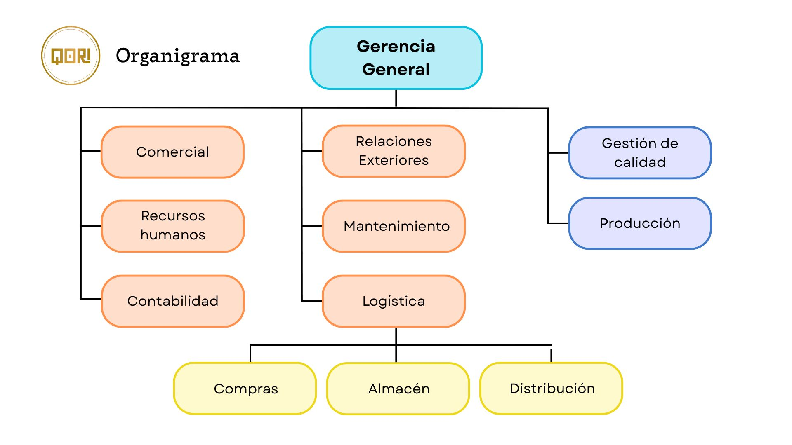

# 1.1. Datos de la Empresa
## Empresa: Qori
---

  

---
## Nombre completo:
AGROINDUSTRIAS PRADO S.A.C.

## RUC:
20605984160

## Teléfono:
+51 990779050

## Ubicación:
Jr. 24 de Junio N° 164 San Juan Bautista, Ayacucho, Perú

## Sector:
Alimentario

## Tamaño de la empresa:
20 empleados

## Productos que ofrece:
- Pasta con quinua orgánica 75% fusilli
- Pasta con quinua orgánica 75% fusilli tricolor
- Nutripasta penne rigate de consomé de cuy y quinua
- Nutripasta spaguetti de consomé de cuy y quinua
- Nutripasta tallarin de consomé de cuy y quinua
- Nutripasta canuto de consomé de cuy y quinua

## Misión:
Somos una empresa dedicada a la producción y comercialización de pastas y snacks, ofrecemos alimentos de alto valor nutricional con propiedades nutritivas, buscamos satisfacer las necesidades de nuestros clientes, entregándoles productos de calidad e inocuidad con un buen servicio a precios accesibles, utilizando constantemente estándares de calidad, manteniendo la eficiencia e innovación de procesos, además estamos comprometidos con el desarrollo de la sociedad, generando empleo en la región de Ayacucho.

## Visión:
Ser una empresa líder en la producción y comercialización de productos saludables y nutritivos a base de cereales andinos orgánicos y convencionales con innovación en su proceso y desarrollo sostenible. Ser reconocido por nuestros clientes, proveedores y competidores, abarcando gran parte del mercado regional, nacional e internacional gracias a sus alianzas con empresas privadas y convenios con el estado, posicionándonos en la mente de cada ciudadano.

## Valores:
- **Calidad**: Ofrecer productos de alto valor nutricional, elaborados bajo estrictos estándares de calidad y salubridad en nuestras plantas de producción
- **Honradez**: Actuar con rectitud en el cumplimiento de nuestra labor diaria, teniendo como guía la sinceridad y la coherencia de nuestras acciones dentro de un marco de integridad y transparencia.
- **Humildad**: Reconocer nuestras debilidades, cualidades y capacidades y aprovecharlas para obrar en bien de los demás, sin decirlo. Reconocemos la propia realidad, sin caer en la arrogancia.
- **Trabajo en equipo**: Estimular la participación de todos los integrantes de la empresa, reconociendo que el esfuerzo conjunto es clave para cumplir con los objetivos y mantener altos estándares de calidad.
- **Puntualidad**: Cumplir con la entrega de una tarea con una obligación, dentro del tiempo estipulado y totalmente comprometido a la realización de ésta.

## Principales procesos de negocio:
| N° | Proceso Principal	                                                                 | Valor que genera |
| --------- | -------------------------------------------------------------------------------- | ------------------ | 
| 
1
  |  Recepción de insumos  | 
Garantiza calidad desde el origen
 | 
| 
2
  |  Almacenamiento de insumos  | 
Conserva integridad de los insumos
 | 
| 
3
  |  Dosificado  | 
Uniformidad en producto final
 | 
| 
4
  |  Mezclado  | 
Masa base de alta calidad
 | 
| 
5
  |  Moldeado  | 
Diversidad de formas y presentaciones
 | 
| 
6
  |  Secado  | 
Conservación post proceso térmico
 |
| 
7
  |  Envasado  | 
Protección y presentación del producto
 |
| 
8
  |  Detección de metales  | 
Seguridad alimentaria
 |
| 
9
  |  Empacado  | 
Preparación para la distribución
 |
| 
10
 |  Almacenamiento de productos  | 
Gestión del stock final
 |
| 
11
 |  Distribución  | 
Entrega al cliente
 |

## Organigrama:
---

  

---