# 1.3. Procesos de Negocio identificados

## MAPA DE PROCESOS
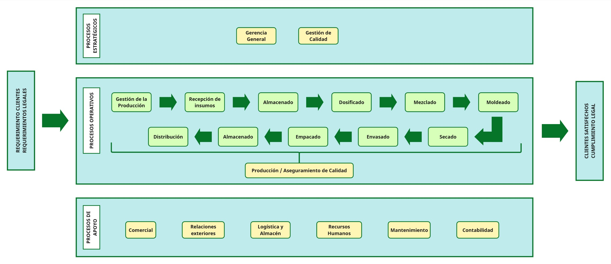

### Módulo Almacen

| N° | Actividad                          | Descripción                                                                 | Responsable           |
|----|------------------------------------|-----------------------------------------------------------------------------|------------------------|
| 1  | **Registrar productos que entran y salen de almacén** | Se registra los lotes de productos que entran al stock y también los productos que salen del almacén, verificando con orden de pedido |Supervisor de almacén|
| 2  | **Registro de Picking**         | Se registra todo el proceso de la preparación para el despacho de mercadería de acuerdo al orden de pedido . | Supervisor de Calidad   |
| 3  | **Registrar Movimientos**         | El supervisor de almacén debe registrar el movimiento de productos dentro del almacén, así como el designar al personal del traslado | Supervisor de almacén |
| 4  | **Generar orden de producción**         | Al alcanzar el minino stock de un producto el jefe del almacén debe generar una solicitud de producción. | Supervisor de almacén   |
| 5  | **Asignar y liberar un espacio para un producto **         | El encargado de almacén debe asignar y liberar espacio para los productos que entran y salen de almacén  | Jefe de Producción   |

### Módulo Control de Producción
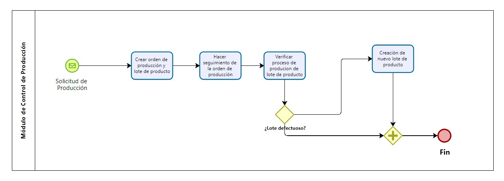
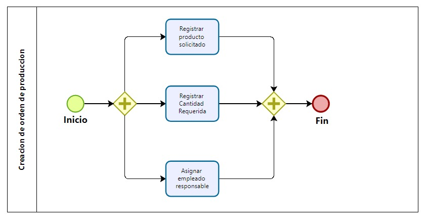
| N° | Actividad                          | Descripción                                                                 | Responsable           |
|----|------------------------------------|-----------------------------------------------------------------------------|------------------------|
| 1  | **Recepcionar solicitud de producción** | Se recibe la solicitud de producción desde el área de almacén por falta de stock o pedido de algún cliente. | Jefe de Producción  |
| 2  | **Crear orden de producción**         | El jefe de producción crea la orden ingresando los datos del producto, su cantidad requerida y el empleado responsable de esa orden de producción. | Jefe de Producción   |
| 3  | **Hacer Seguimiento a las orden de producción**         | El jefe de producción se encarga de supervisar el avance y el proceso de cada orden de producción para así evitar fallos y retrasos. | Jefe de Producción  |
| 4  | **Verificar lote de producto**         | Se verifica el proceso de producción del lote de producto para ver si es que hay algún fallo, para así generar un nuevo lote. | Jefe de Producción   |
| 5  | **Creacion de lote nuevo**         | En el caso de que si haya fallo, se crea un lote nuevo dentro de la misma orden de producción para completar con la cantidad requerida. | Jefe de Producción   |

### Módulo Proceso de compra
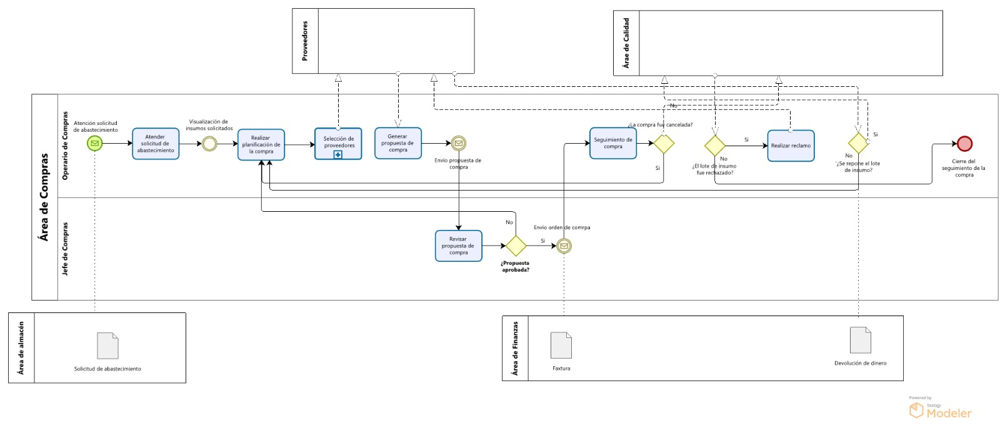
| N° | Actividad                          | Descripción                                                                 | Responsable           |
|----|------------------------------------|-----------------------------------------------------------------------------|------------------------|
| 1  | **Revisión de la solicitud de abastecimiento** | El operario de compras revisa la solicitud de abastecimiento, donde se detallan los insumos pedidos por el área de almacén. | Operario de Compras  |
| 2  | **Realización de la planificación de la compra** | El operario de compras selecciona posibles proveedores para realizar la compra. La propuesta incluye detalles del insumo, cantidades requeridas, condiciones esperadas de entrega y posibles descuentos. | Operario de Compras  |
| 3  | **Generación de propuesta de compra** | El operario de compras elabora una propuesta formal, seleccionando proveedores registrados previamente. Este documento es registrado en el sistema para su posterior evaluación.| Operario de Compras  |
| 4  | **Revisión de la propuesta** | El jefe de compras revisa cuidadosamente las condiciones pactadas en la propuesta: fecha de entrega estimada, costo total, descuentos aplicados y cumplimiento de políticas internas. Si todo está correcto, aprueba la propuesta para pasar a la siguiente fase. | Jefe de Compras  |
| 5  | **Generación de orden de compra** | A partir de la propuesta validada, el jefe de compras genera una orden de compra oficial. Este documento sirve como contrato y detalla el acuerdo entre la empresa y el proveedor. | Jefe de Compras   |
| 6  | **Envío orden de compra** | El jefe de compras envía la orden de compra oficial al área de finanzas, este con el objetivo de realizar el pago de los lotes de insumos a adquirir. | Jefe de Compras   |
| 7  | **Seguimiento de la compra** | Se tiene un control continuo de la compra, esto para verificar si se está cumpliendo con los plazos acordados para su entrega, como también registrar los nuevos lotes de insumo que ingresarán a calidad. | Operario de Compras  |
| 8  | **Atención del reclamo** | En caso de que el área de calidad rechaze algun lote de insumo, se deberá contactar con el proveedor para realizar la reposición del lote o la devolución del dinero. | Operario de Compras |

### Módulo Proceso Producción
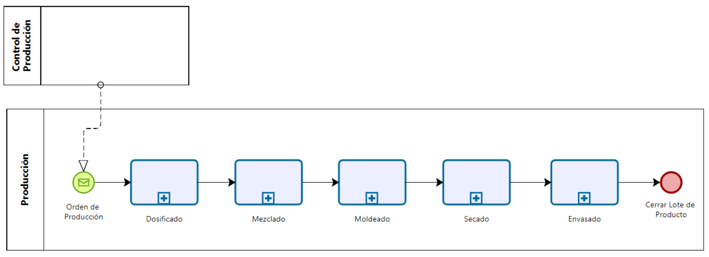
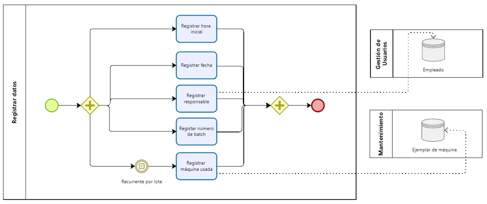
| N° | Actividad                          | Descripción                                                                 | Responsable           |
|----|------------------------------------|-----------------------------------------------------------------------------|------------------------|
| 1  | **Recepción de la orden de producción** | Se recibe la orden de producción con los lotes asignados y las cantidades programadas. Gracias a ello puede empezar el proceso de producción. | Jefe de Producción  |
| 2  | **Registrar datos de dosificado**         | El operario ingresa los datos y parámetros requeridos para el proceso de dosificado. Se guardan automáticamente el responsable y la fecha del proceso. | Operario de Producción  |
| 3  | **Registrar datos de mezclado**         | El operario ingresa los datos y parámetros requeridos para el proceso de mezclado. Se guardan automáticamente el responsable y la fecha del proceso. | Operario de Producción  |
| 4  | **Registrar datos de moldeado**         | El operario ingresa los datos y parámetros requeridos para el proceso de moldeado. Se guardan automáticamente el responsable y la fecha del proceso. | Operario de Producción  |
| 5  | **Registrar datos de secado**         | El operario ingresa los datos y parámetros requeridos para el proceso de secado. Se guardan automáticamente el responsable y la fecha del proceso. | Operario de Producción  |
| 6  | **Registrar datos de envasado**         | El operario ingresa los datos y parámetros requeridos para el proceso de envasado. Se guardan automáticamente el responsable y la fecha del proceso. | Operario de Producción  |
| 7  | **Cerrar el lote de producto**                     | Si todos los eventos han concluído se puede proceder a cerrar el lote de producto. | Operario de Producción                     |

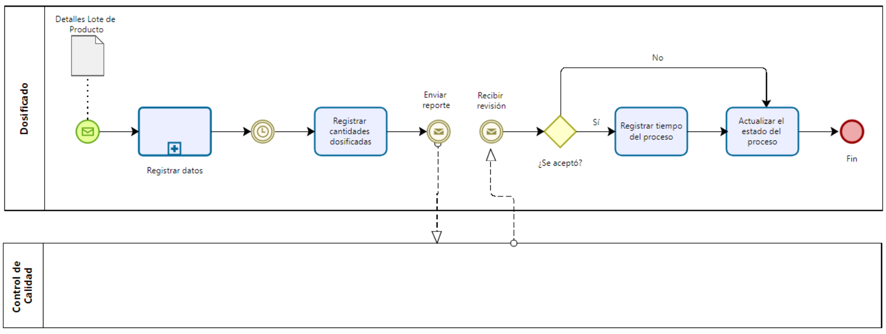
| N° | Actividad                          | Descripción                                                                 | Responsable           |
|----|------------------------------------|-----------------------------------------------------------------------------|------------------------|
| 1  | **Recepción del lote de producto** | Se reciben los datos del lote de producto, el cual contendrá las especificaciones de cantidades necesarias para su producción. | Operario de Producción  |
| 2  | **Registrar datos de dosificado**         | El operario ingresa los datos generales del proceso de dosificado, como hora, etc. | Operario de Producción  |
| 3  | **Registrar cantidades dosificadas**    | Se registran las cantidades específicas por lote de insumo utilizado. | Operario de Producción  |
| 4  | **Enviar reporte a Control de Calidad** | Una vez completado el registro, se envía un informe para revisión y validación. | Operario de Producción  |
| 5  | **Revisión del proceso**                | El área de Control de Calidad revisa los parámetros registrados y determina si son aceptables. | Encargado de Calidad  |
| 6  | **Registrar tiempo del proceso**        | Se registra cuánto duró el proceso de dosificado, solo si fue aprobado.      | Operario de Producción  |
| 7  | **Actualizar estado del proceso**       | Se actualiza el estado del proceso a "Completado" si se ha aceptado por Control de Calidad, si no el estado pasa a ser "Retirado". | Operario de Producción  |
| 8  | **Fin del proceso**                     | Se concluye el proceso de dosificado, quedando listo para pasar al siguiente: mezclado. | —                      |

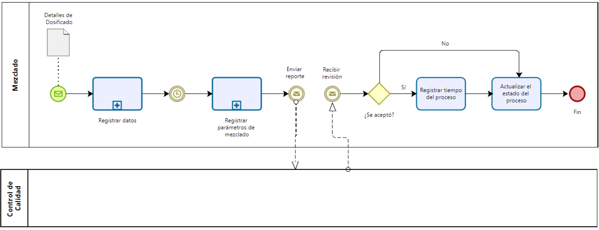
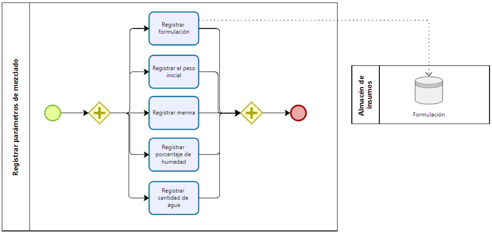
| N° | Actividad                          | Descripción                                                                 | Responsable           |
|----|------------------------------------|-----------------------------------------------------------------------------|------------------------|
| 1  | **Recepción de detalles del dosificado** | Se reciben los datos del proceso anterior (dosificado), que incluyen insumos utilizados y cantidades. | Operario de Producción  |
| 2  | **Registrar datos de mezclado**         | El operario ingresa los datos generales del proceso de mezclado, como el número de batch, hora, etc. | Operario de Producción  |
| 3  | **Registrar parámetros de mezclado**    | Se registran los valores específicos del proceso: formulación, peso inicial, merma, porcentaje de humedad y cantidad de agua. | Operario de Producción  |
| 4  | **Enviar reporte a Control de Calidad** | Una vez completado el registro, se envía un informe para revisión y validación. | Operario de Producción  |
| 5  | **Revisión del proceso**                | El área de Control de Calidad revisa los parámetros registrados y determina si son aceptables. | Encargado de Calidad  |
| 6  | **Registrar tiempo del proceso**        | Se registra cuánto duró el proceso de mezclado, solo si fue aprobado.      | Operario de Producción  |
| 7  | **Actualizar estado del proceso**       | Se actualiza el estado del proceso a "Completado" si se ha aceptado por Control de Calidad, si no el estado pasa a ser "Retirado". | Operario de Producción  |
| 8  | **Fin del proceso**                     | Se concluye el proceso de mezclado, quedando listo para pasar al siguiente: moldeado. | —                      |

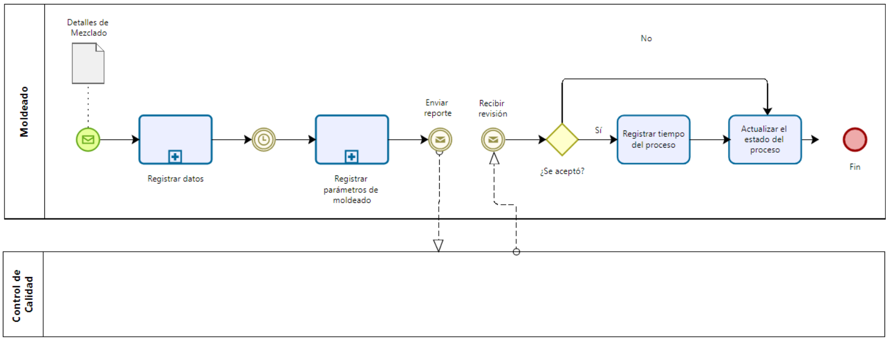
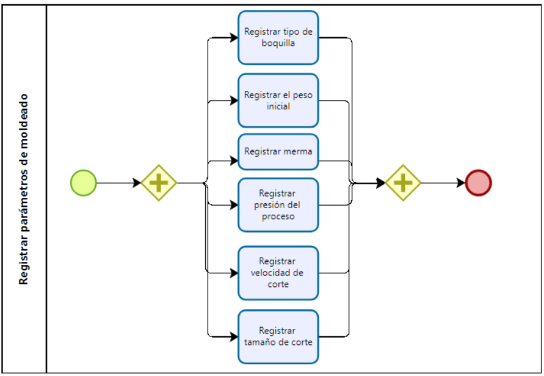
| N° | Actividad                          | Descripción                                                                 | Responsable           |
|----|------------------------------------|-----------------------------------------------------------------------------|------------------------|
| 1  | **Recepción de detalles del mezclado** | Se reciben los datos del proceso anterior (mezclado), que incluyen insumos utilizados y peso. | Operario de Producción  |
| 2  | **Registrar datos de moldeado**         | El operario ingresa los datos generales del proceso de moldeado, como el número de batch, hora, etc. | Operario de Producción  |
| 3  | **Registrar parámetros de moldeado**    | Se registran los valores específicos del proceso: tipo de boquilla, peso inicial, merma, presion, velocidad de corte y tamaño de corte. | Operario de Producción  |
| 4  | **Enviar reporte a Control de Calidad** | Una vez completado el registro, se envía un informe para revisión y validación. | Operario de Producción  |
| 5  | **Revisión del proceso**                | El área de Control de Calidad revisa los parámetros registrados y determina si son aceptables. | Encargado de Calidad  |
| 6  | **Registrar tiempo del proceso**        | Se registra cuánto duró el proceso de moldeado, solo si fue aprobado.      | Operario de Producción  |
| 7  | **Actualizar estado del proceso**       | Se actualiza el estado del proceso a "Completado" si se ha aceptado por Control de Calidad, si no el estado pasa a ser "Retirado". | Operario de Producción  |
| 8  | **Fin del proceso**                     | Se concluye el proceso de moldeado, quedando listo para pasar al siguiente: secado. | —                      |

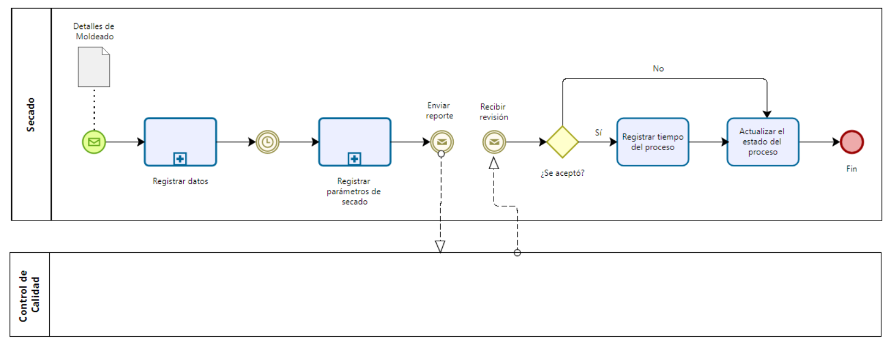
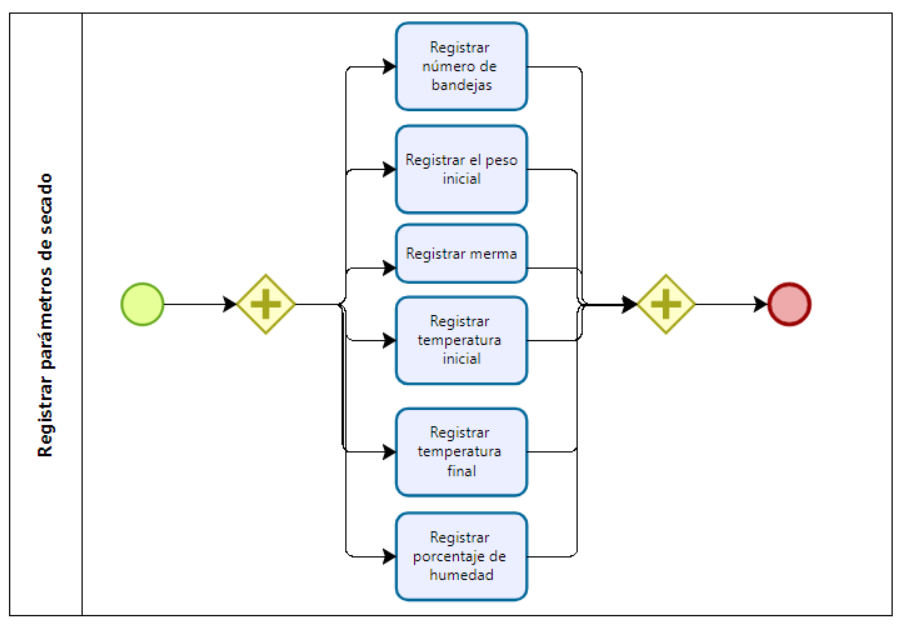
| N° | Actividad                          | Descripción                                                                 | Responsable           |
|----|------------------------------------|-----------------------------------------------------------------------------|------------------------|
| 1  | **Recepción de detalles del moldeado** | Se reciben los datos del proceso anterior (moldeado). | Operario de Producción  |
| 2  | **Registrar datos de secado**         | El operario ingresa los datos generales del proceso de secado, como el número de batch, hora, etc. | Operario de Producción  |
| 3  | **Registrar parámetros de secado**    | Se registran los valores específicos del proceso: peso inicial, merma, número de bandejas, temperatura inicial, temperatura final y porcentaje de humedad. | Operario de Producción  |
| 4  | **Enviar reporte a Control de Calidad** | Una vez completado el registro, se envía un informe para revisión y validación. | Operario de Producción  |
| 5  | **Revisión del proceso**                | El área de Control de Calidad revisa los parámetros registrados y determina si son aceptables. | Encargado de Calidad  |
| 6  | **Registrar tiempo del proceso**        | Se registra cuánto duró el proceso de secado, solo si fue aprobado.      | Operario de Producción  |
| 7  | **Actualizar estado del proceso**       | Se actualiza el estado del proceso a "Completado" si se ha aceptado por Control de Calidad, si no el estado pasa a ser "Retirado". | Operario de Producción  |
| 8  | **Fin del proceso**                     | Se concluye el proceso de secado, quedando listo para pasar al siguiente: envasado. | —                      |

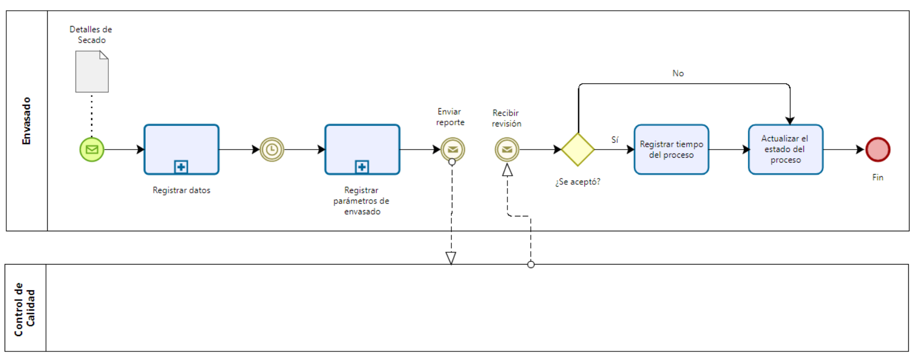
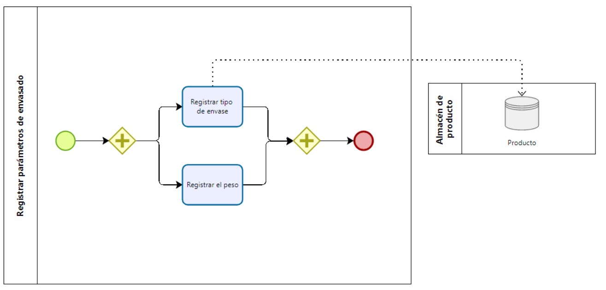
| N° | Actividad                          | Descripción                                                                 | Responsable           |
|----|------------------------------------|-----------------------------------------------------------------------------|------------------------|
| 1  | **Recepción de detalles del secado** | Se reciben los datos del proceso anterior (secado). | Operario de Producción  |
| 2  | **Registrar datos de envasado**         | El operario ingresa los datos generales del proceso de envasado, como el número de batch, hora, etc. | Operario de Producción  |
| 3  | **Registrar parámetros de envasado**    | Se registran los valores específicos del proceso: tipo de envase y peso. | Operario de Producción  |
| 4  | **Enviar reporte a Control de Calidad** | Una vez completado el registro, se envía un informe para revisión y validación. | Operario de Producción  |
| 5  | **Revisión del proceso**                | El área de Control de Calidad revisa los parámetros registrados y determina si son aceptables. | Encargado de Calidad  |
| 6  | **Registrar tiempo del proceso**        | Se registra cuánto duró el proceso de envasado, solo si fue aprobado.      | Operario de Producción  |
| 7  | **Actualizar estado del proceso**       | Se actualiza el estado del proceso a "Completado" si se ha aceptado por Control de Calidad, si no el estado pasa a ser "Retirado". | Operario de Producción  |
| 8  | **Cerrar el lote de producto**                     | Se concluye el proceso de envasado, y ahora se puede proceder a cerrar el lote de producto pues todo ha culminado. | Operario de Producción                     |

### Módulo Control de Calidad
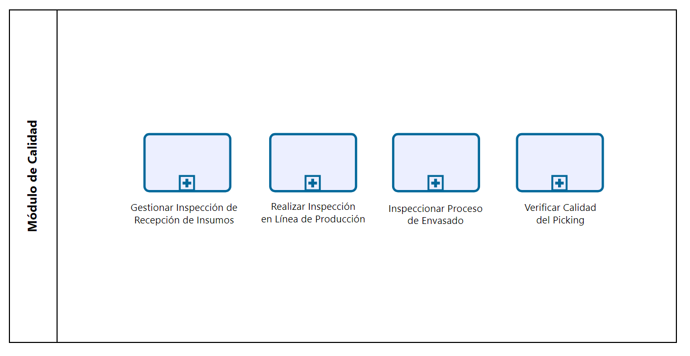

#### - Inspección de Recepción de Insumos
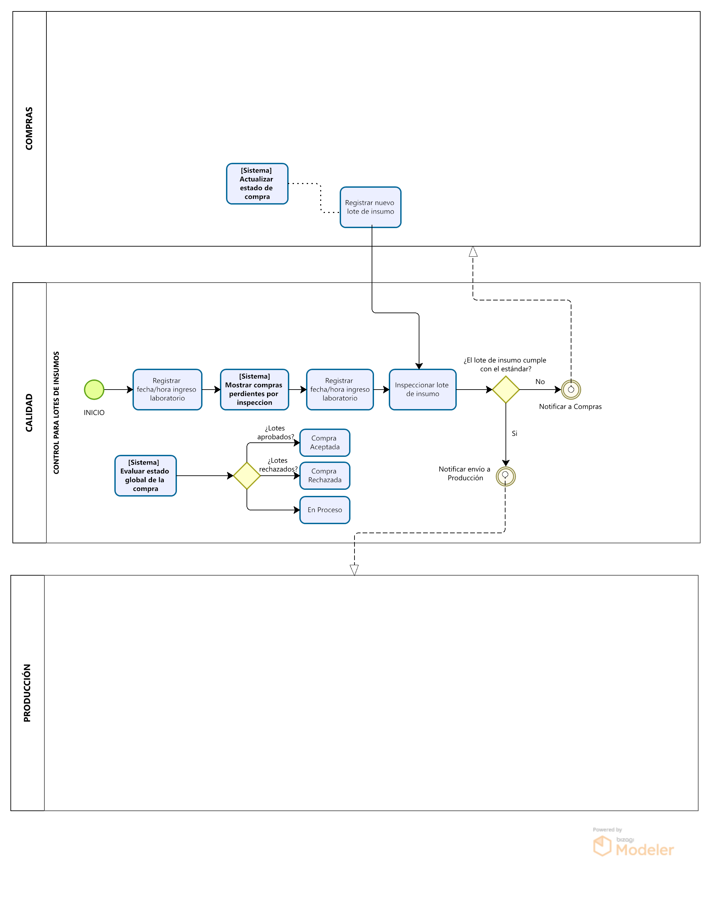
| N° | Actividad                          | Descripción                                                                 | Responsable           |
|----|------------------------------------|-----------------------------------------------------------------------------|------------------------|
| 1  | **Registrar fecha/hora de ingreso a laboratorio** | Se registra la llegada del lote de insumo para su inspección, incluyendo la fecha y hora de ingreso.  | Inspector de Calidad  |
| 2  | **Mostrar compras pendientes por inspección**  | El sistema lista las órdenes de compra que aún no han sido inspeccionadas. | Sistema   |
| 3  | **Seleccionar compra y visualizar lotes**  | Se selecciona una compra pendiente y se visualizan los lotes de insumos asociados. | Inspector de Calidad  |
| 4  | **Inspeccionar lote de insumo**         | Se realiza la revisión física o de laboratorio según el tipo de insumo. | Inspector de Calidad | 
| 5  | **Ingresar resultado de inspección**         | Se ingresa si el lote está aprobado o rechazado, incluyendo observaciones y evidencia. | Inspector de Calidad | 
| 6  | **Evaluar estado general de la compra**         | Se realiza la revisión física o de laboratorio según el tipo de insumo. | Sistema| 
| 7  | **Notificar resultado**         | Se realiza la revisión física o de laboratorio según el tipo de insumo. | Sistema | 
| 8  | **Reposición de lote rechazado**         | 	Compras registra un nuevo lote para reponer el rechazado. | Área de Compras | 
| 9  | **Inspección del nuevo lote**         | El lote repuesto vuelve al flujo de inspección. | Inspector de Calidad | 

#### - Inspección en Línea de Producción
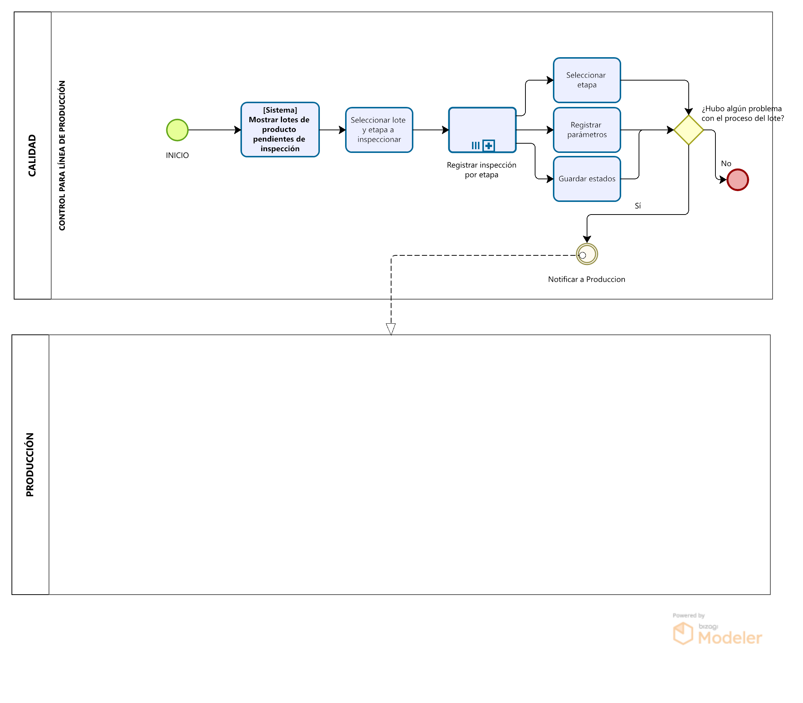
| N° | Actividad                          | Descripción                                                                 | Responsable           |
|----|------------------------------------|-----------------------------------------------------------------------------|------------------------|
| 1  | **Visualizar órdenes de producción en proceso** | Se consulta qué lotes están activos en producción y en qué proceso se encuentran. | Sistema  |
| 2  | **Seleccionar lote a inspeccionar**  | Se elige el lote activo y el proceso productivo correspondiente (mezclado, moldeado, etc.). | Inspector de Calidad   |
| 3  | **Registrar inspección del proceso**  | Se registra la inspección de calidad para el proceso seleccionado (ej: parámetros de humedad, temperatura, etc.). | Inspector de Calidad  |
| 4  | **Ingresar resultado de inspección**         | Se determina si el proceso fue aprobado o rechazado. | Inspector de Calidad | 
| 5  | **Notificar rechazo (si aplica)**         | 	Si se rechaza, se notifica al área de Producción para que repita el proceso. | Sistema | 
| 6  | **Reinspección del proceso corregido**         | Se repite la inspección una vez corregido el proceso. | Inspector de Calidad | 
| 7  | **Aprobación del proceso completo**         | Cuando todos los procesos del lote están aprobados, el sistema lo marca como aprobado para envasado. | Sistema | 

#### - Inspección de Envasado
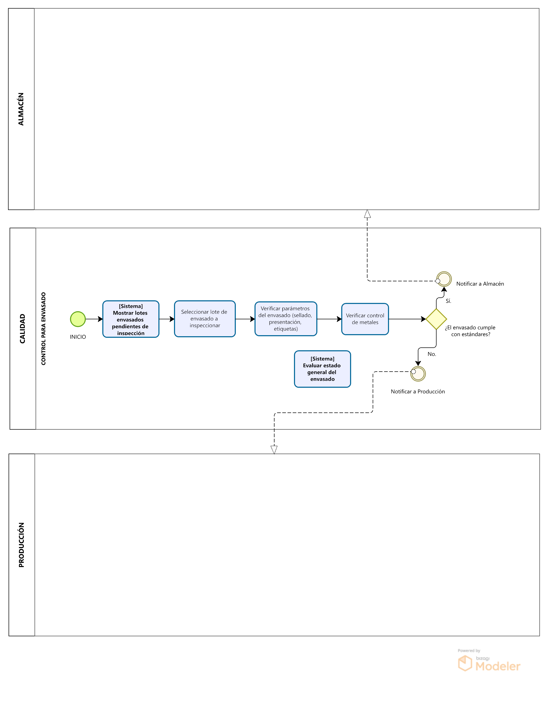
| N° | Actividad                          | Descripción                                                                 | Responsable           |
|----|------------------------------------|-----------------------------------------------------------------------------|------------------------|
| 1  | **Seleccionar lote aprobado para envasado** | Se identifican los lotes que han culminado los procesos previos y están listos para envasado. | Inspector de Calidad  |
| 2  | **Verificar parámetros de envasado**  | 	Se inspeccionan variables como el tipo de empaque, peso neto, etiquetas, cierre, etc. | Inspector de Calidad   |
| 3  | **Ingresar resultado de inspección**  | 	Se aprueba o rechaza el proceso de envasado, registrando evidencias si corresponde. | Inspector de Calidad  |
| 4  | **Notificar resultado a Producción**         | Se notifica el estado del envasado para continuar o rehacerlo.	 | Sistema | 

#### - Inspección de Picking
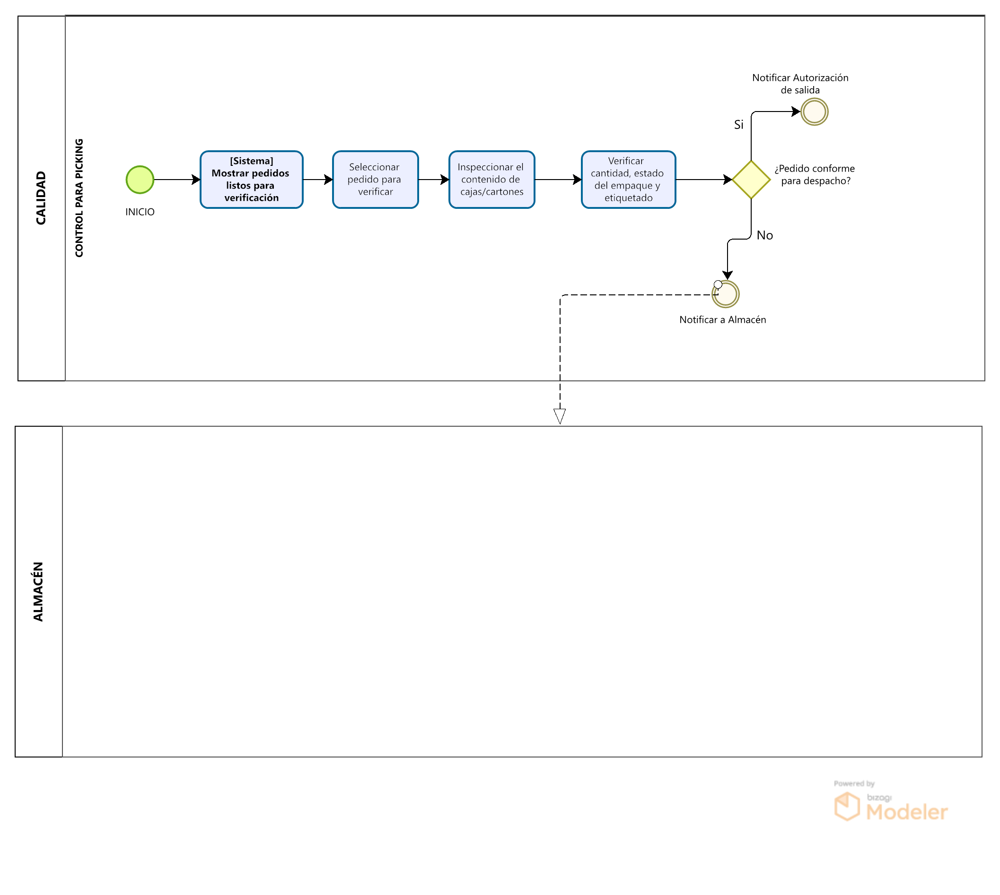
| N° | Actividad                          | Descripción                                                                 | Responsable           |
|----|------------------------------------|-----------------------------------------------------------------------------|------------------------|
| 1  | **Seleccionar solicitud de picking a verificar** | Se selecciona una solicitud de despacho lista para verificación final. | Inspector de Calidad  |
| 2  | **Inspeccionar ejemplares de cajas/cartones**  | Se realiza revisión visual de estado de cajas, sellado, rotulado, y condiciones físicas. | Inspector de Calidad   |
| 3  | **Ingresar resultado de inspección**  | 	Se registra si el picking está en condiciones óptimas. | Inspector de Calidad  |
| 4  | **Inspeccionar lote de insumo**         | Se autoriza el despacho si cumple o se rechaza para corrección. | Inspector de Calidad | 
| 5  | **Ingresar resultado de inspección**         | Se comunica el resultado al área logística para su gestión final. | Sistema | 

### Módulo Mantenimiento
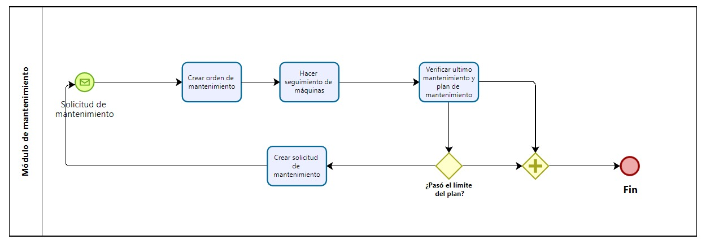
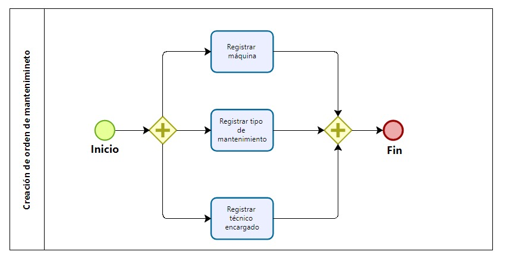
| N° | Actividad                          | Descripción                                                                 | Responsable           |
|----|------------------------------------|-----------------------------------------------------------------------------|------------------------|
| 1  | **Recepcionar solicitud de mantenimiento** | Se recibe la solicitud de mantenimiento desde el área de calidad o también desde la misma área de mantenimiento, esto depende de si el mantenimiento es preventivo o correctivo | Responsable de mantenimiento.  |
| 2  | **Crear orden de mantenimiento**         | Se crea la orden de mantenimiento especificando la máquina, el tipo de mantenimiento que se relaizará y el técnico asignado. | Responsable de mantenimiento.   |
| 3  | **Hacer Seguimiento de las máquinas**         | Se verifican los estados operativos de las máquinas al igual que su plan de mantenimiento para ver si necesita de un mantenimiento preventivo | Responsable de mantenimiento/Técnico  |
| 4  | **Crear solicitud de mantenimiento**         | En el caso de que se haya pasado el límite del plan de mantenimiento, se crea una solicitud de mantenimiento preventivo. | Responsable de mantenimiento | 

### Módulo Distribución - Procesos
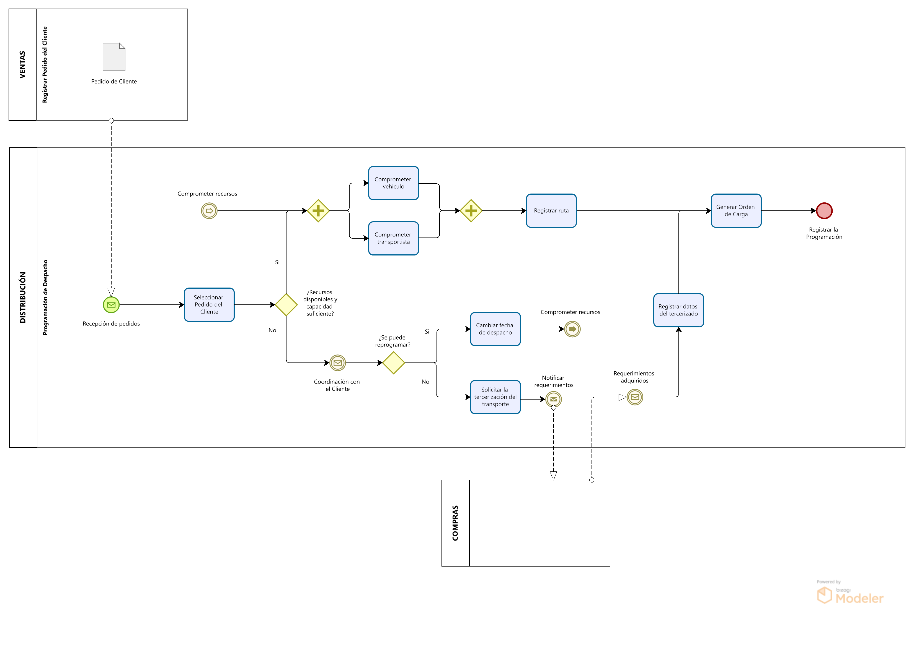

| N° | Actividad |Descripción     | Responsable    |
|----|------------------------|------------------|----------------|
| 1  | **Recepción de Pedidos** | El encargado de Distribución recibe la lista de pedidos para evaluar la programación del despacho | Jefe de Distribución  |
| 2  | **Seleccionar Pedidos de los Clientes**   | El encargado escoge los pedidos que se despacharán bajo una misma Orden de Carga  | Jefe de Distribución |
| 3  | **Evaluar la disponibilidad y capacidad de los recursos**   | El transporte lo puede realizar la propia empresa a menos que no dispongan de vehículos disponibles con la capacidad requerida | Jefe de Distribución |
| 4  | **Comprometer a los recursos**   | El encargado compromete al transportista y vehículo para el despacho de los pedidos, es decir, se registra su información | Jefe de Distribución  |
| 5  | **Registrar datos de la ruta**   | El encargado especifica al transportista todos los puntos de entrega por cada pedido | Jefe de Distribución  |
| 6  | **Coordinación con el Cliente** | Si no se pueden comprometer los recursos para el despacho de los pedidos, y dependiendo del cliente, el encargado puede coordinar un cambio de fecha. Si este cambio se acepta entonces se procede con el flujo normal de Programación del Despacho, caso contrario, se procede a tercerizar el transporte | Jefe de Distribución |
| 7  | **Registrar datos del tercerizado**   | El encargado registra los datos de la empresa que realizará el despacho, además del vehículo y transportista | Jefe de Distribución |
| 8  | **Generar Orden de Carga**   | La programación finaliza con la creación de la Orden de Carga que tiene el fin de ser una promesa de un futuro despacho | Jefe de Distribución |

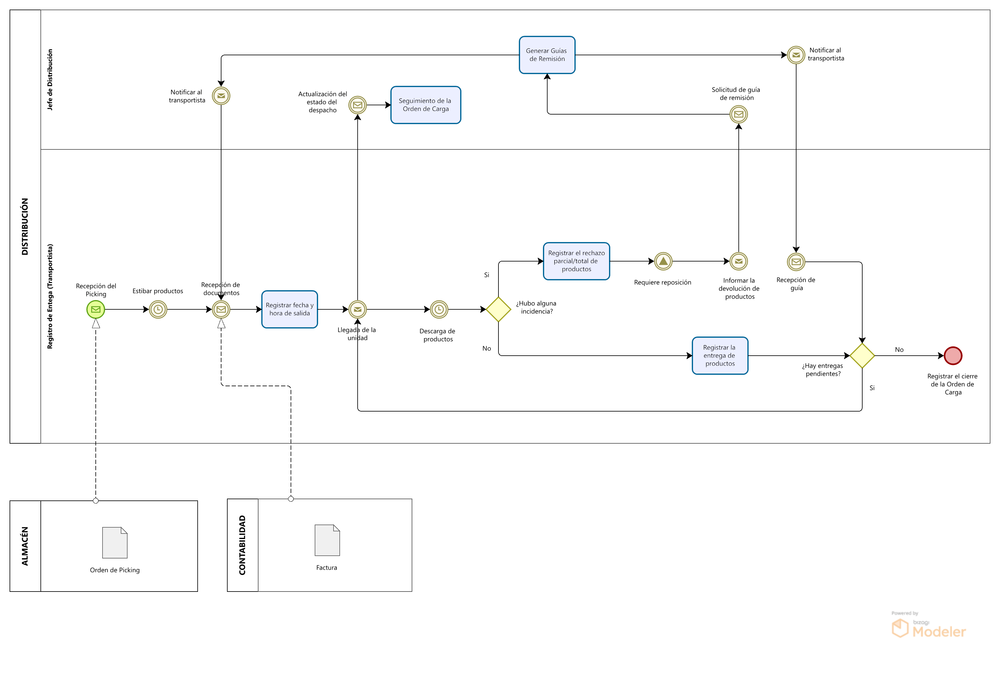
| N° | Actividad |Descripción     | Responsable    |
|----|------------------------|------------------|----------------|
| 1  | **Recepción del Picking y estibación de productos** | El transportista recibe los productos para cargarlos en el vehículo | Transportista |
| 2  | **Recepción de Documentos** | De acuerdo al aspecto legal, antes de que el transportista comience a transitar debe contar con los documentos requeridos como la Guia de Remisión y Factura | Transportista |
| 3  | **Seguimiento** | El encargado dispone de la información del estado del despacho de cada pedido | Jefe de Distribución |
| 4  | **Llegada de la Unidad y descarga de productos** | El transportista registra la fecha y hora de llegada, sin embargo, todavía no se da la conformidad de la entrega  | Transportista |
| 5  | **Registro de Incidencias** | El transportista registra el rechazo parcial o total de los productos, también registra el motivo del rechazo y la cantidad de empaques observados | Transportista |
| 6  | **Informar la devolución de productos** | El transportista debe devolver los productos al almacén, pero para ello requiere otra guía de remisión por lo que deberá informar a la empresa la devolución de los productos | Transportista |
| 7  | **Registrar la conformidad de la entrega** | En el caso de que la entrega esté conforme, el transportista registra la información y los datos de entrega | Transportista |
| 8  | **Cierre de la Orden de Carga** | Si no hay pedidos pendientes de entregar, entonces se procederá con el cierre de la Orden de Carga | Transportista |

| N° | Actividad |Descripción     | Responsable    |
|----|------------------------|------------------|----------------|
| 1  | **Notificación de la reposición de productos** | El encargado recibe la información de la devolución e inconformidad por lo que coordina con el Cliente la nueva fecha de entrega de los productos a reponer | Jefe de Distribución |
| 2  | **Programación de Despacho** | Se procede con una nueva programación para comprometer a los recursos en la nueva fecha | Jefe de Distribución |
| 3  | **Registro de Entrega** | Se procede con el despacho nuevamente y se espera la conformidad del cliente | Jefe de Distribución |

### Módulo de Almacen de Insumos
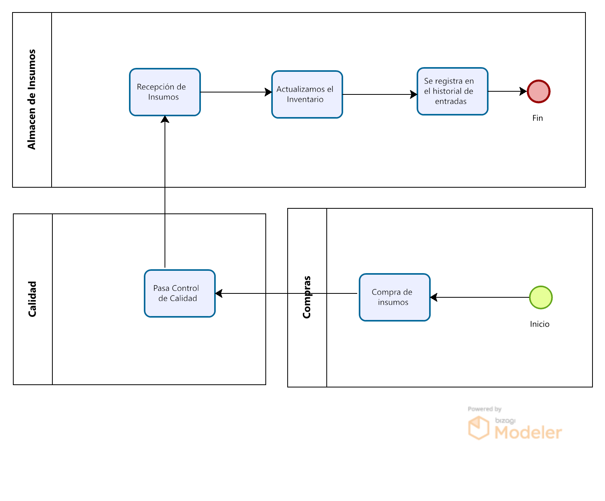
| N° | Actividad                          | Descripción                                                                 | Responsable           |
|----|------------------------------------|-----------------------------------------------------------------------------|------------------------|
| 1  | **Compra de Insumos** | Se reliazo la adquision de insumos solicitados por la planificacion de produccion . | Jefe de Compras |
| 2  | **Pasa Control de Calidad**         | Los insumos adquiridos son verificados para asegurar que cumplan los estándares de calidad requeridos. | Operario de Calidad   |
| 3  | **Recepción de Insumos**         | Los insumos aprobados son recepcionados formalmente por operarios del almacen. | Operario de Almacen  |
| 4  | **Actualizamos el Inventario**         | Se actualizan los niveles de stock en el sistema, incluyendo cantidad y ubicación. | Operario de Almacen   |
| 5  | **Se registra en el historial de entradas**         | Se guarda un registro detallado de la entrada de los insumos  para auditorías y asegurar la trazabilidad.| Operario de Almacen  |     

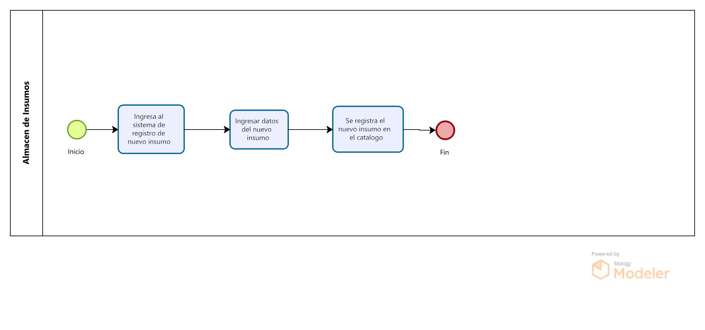
| N° | Actividad                          | Descripción                                                                 | Responsable           |
|----|------------------------------------|-----------------------------------------------------------------------------|------------------------|
| 1  | **Orden de Abastecimiento** | El area de Control de Produccion solicita insumos para su los lotes de producto a producir segun su orden de produccion. | Jefe de Control de Produccion |
| 2  | **Buscar Inventario de Insumos**  | Si existe stock disponible. Se realiza la busqueda de lotes de insumos para los productos a producir. | Operario de Almacen  |
| 3  | **Asignar Insumos Solicitados**     | El operario de alamcen asigna los insumos de acuerdo a los lotes a producir mediante el metodo FIFO. | Operario de Almacen  |
| 4  | **Se registra la salida en el historial**    | Se registra a detalle la salida de insumos segun lote a producir para asegurar la trazabilidad. | Operario de Almacen   |
| 5  | **Actualizamos el Inventario**     | El sistema actualiza en stock de cada lote insumo.| Sistema de Almacen   |
| 6  | **Alerta de Stocl minimo**    | Si Stock actual es menor al stock minimo. Entones el sistema manda un a alerta al area de almacen, | Sistema de Almacen  |     
| 7  | **Entrega al area de Produccion**   | El Operario de Almacen realiza la entrega de insumos solicitados en la orden de abastecimiento. | Operario de Almacen |     
| 8  | **Solicitud de Insumos**   | Si no hay stock disponible. El Operario del almacen realiza una solicitud de Insumos al area de Compras.|Operario de Almacen  |
| 9  | **Detallar Insumos Requeridos**    | El Operario del Almacen registra la cantidad requerida de los insumos faltantes. | Operario de Almacen  |     
| 10  | **Se encia la solicitud**   | El sistema envia una la solicitud de insumos y notifica al area de compras. | Operario de Almacen |   
