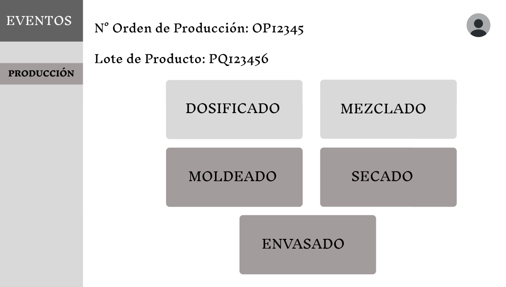

# **3.1. Módulo Proceso Productivo**

## **Caso de uso #1: Visualizar eventos por lote**

| **ID**                         | CU-01                                                                 |
|-------------------------------|------------------------------------------------------------------------|
| **Actor(es)**                  | Operario de Producción                         |
| **Descripción**                | Muestra una tabla con todos los eventos de un lote, permitiendo su visualización, el poder agregar eventos y el cerrar el Lote de Producción. |
| **Precondiciones**             | El usuario debe haber iniciado sesión y debe existir una Orden de Producción con Lote activo. |
| **Flujo Principal**            | 1. El usuario accede a la vista de Lotes por Orden de Producción. 2. Selecciona un Lote de Producción. 3. Visualiza la tabla con los eventos. 4. Puede registrar eventos o solicitar el cierre del lote (si se ha culminado). |
| **Requerimientos Especiales** | Orden de Producción con Lote activo. |
| **Frecuencia de Uso**          | Constante. Orientado a usuarios paramétricos.                  |

### **Flujo Principal:**
1. El operario de Producción ingresa a la vista de Lotes por Orden de Producción. 

2. Si el empleado escoge "Detalle" se visualizarán todos los eventos relacionados a un Lote de Producto. Mientras no tengan el estado de "Completado" o "En inspección" podrá editarlos.

3. Si el operario escoge "Registrar evento" se desplagará una vista donde podrá elegir el tipo de evento que quiere registrar.

## **Caso de uso #2: Registrar datos del Dosificado**

| **ID**                         | CU-02                                                                 |
|-------------------------------|------------------------------------------------------------------------|
| **Actor(es)**                  | Operario de Producción                                                 |
| **Descripción**                | El operario ingresa el valor de las cantidades medidas de los insumos requeridos de acuerdo a la formulación. |
| **Precondiciones**             | El usuario debe haber iniciado sesión y debe existir una Orden de Producción con Lote activo. |
| **Flujo Principal**            | 1. El usuario elige el botón de "Registrar evento" desde la vista de eventos. 2. El sistema muestra la vista con los tipos de evento. 3. El usuario elige el evento de Dosificado 4. El usuario registra las cantidades dosificadas según el insumo mostrado, hora de inicio y hora de fin del proceso. 5. Se guarda el evento con fecha y responsable. 6. Se marca como completado. 5. Se envía a Control de Calidad. |
| **Requerimientos Especiales** | Orden de Producción con Lote activo.       |
| **Frecuencia de Uso**          | Constante. Orientado a usuarios paramétricos.                                 |

### **Flujo Principal:**
1. El operario eligió el botón de "Registrar Evento" de la vista de eventos por Lote.

2. Si el empleado escoge "Dosificado" se mostrará la pantalla donde tendrá que ingresar cada valor solicitado. La fecha y el responsable se registra automáticamente. Podrá editar los datos mientras no lo marque como completado.

3. Si lo marca como completado, el proceso se enviará a Control de Calidad y pasará al estado de "En inspección", una vez aprobado regresará al estado de "Completado".

## **Caso de uso #3: Registrar datos del Mezclado**

| **ID**                         | CU-03                                                                 |
|-------------------------------|------------------------------------------------------------------------|
| **Actor(es)**                  | Operario de Producción                                                 |
| **Descripción**                | El operador registra los datos resaltantes para el evento de mezclado, como: máquina usada, tiempo del proceso, hora de inicio, merma, sus parámetros, etc. |
| **Precondiciones**             | El usuario debe haber iniciado sesión y el lote debe haber sido dosificado previamente y haber pasado Control de Calidad.                       |
| **Flujo Principal**            | 1. El usuario elige el botón de "Registrar evento" desde la vista de eventos. 2. El sistema muestra la vista con los tipos de evento. 3. El usuario elige el evento de Mezclado 4. El usuario registra la máquina usada, tiempo del proceso, hora de inicio, merma, sus parámetros, etc. 5. Se guarda el evento con fecha y responsable. 6. Se marca como completado. 5. Se envía a Control de Calidad. |
| **Requerimientos Especiales** | Validación del evento de Dosificado por Control de Calidad.        |
| **Frecuencia de Uso**          | Constante. Orientado a usuarios paramétricos.                                   |

### **Flujo Principal:**
1. El operario eligió el botón de "Registrar Evento" de la vista de eventos por Lote.

2. Si el empleado escoge "Mezclado" se mostrará la pantalla donde tendrá que ingresar cada valor solicitado. La fecha y el responsable se registra automáticamente. Podrá editar los datos mientras no lo marque como completado.

3. Si lo marca como completado, el proceso se enviará a Control de Calidad y pasará al estado de "En inspección", una vez aprobado regresará al estado de "Completado".

## **Caso de uso #4: Registrar datos del Moldeado**

| **ID**                         | CU-04                                                                 |
|-------------------------------|------------------------------------------------------------------------|
| **Actor(es)**                  | Operario de Producción                                                 |
| **Descripción**                | El operador registra los datos resaltantes para el evento de moldeado, como: máquina usada, tiempo del proceso, hora de inicio, merma, tipo de boquilla, sus parámetros, etc. |
| **Precondiciones**             | El usuario debe haber iniciado sesión y el lote debe haber sido mezclado previamente y haber pasado Control de Calidad.                       |
| **Flujo Principal**            | 1. El usuario elige el botón de "Registrar evento" desde la vista de eventos. 2. El sistema muestra la vista con los tipos de evento. 3. El usuario elige el evento de Moldeado 4. El usuario registra la máquina usada, tiempo del proceso, hora de inicio, merma, tipo de boquilla, sus parámetros, etc. 5. Se guarda el evento con fecha y responsable. 6. Se marca como completado. 5. Se envía a Control de Calidad. |
| **Requerimientos Especiales** | Validación del evento de Mezclado por Control de Calidad.        |
| **Frecuencia de Uso**          | Constante. Orientado a usuarios paramétricos.                                   |

### **Flujo Principal:**
1. El operario eligió el botón de "Registrar Evento" de la vista de eventos por Lote.

2. Si el empleado escoge "Moldeado" se mostrará la pantalla donde tendrá que ingresar cada valor solicitado. La fecha y el responsable se registra automáticamente. Podrá editar los datos mientras no lo marque como completado.

3. Si lo marca como completado, el proceso se enviará a Control de Calidad y pasará al estado de "En inspección", una vez aprobado regresará al estado de "Completado".

## **Caso de uso #5: Registrar datos del Secado**

| **ID**                         | CU-05                                                                 |
|-------------------------------|------------------------------------------------------------------------|
| **Actor(es)**                  | Operario de Producción                                                 |
| **Descripción**                | El operador registra los datos resaltantes para el evento de secado, como: máquina usada, tiempo del proceso, hora de inicio, merma, número de bandejas, sus parámetros, etc. |
| **Precondiciones**             | El usuario debe haber iniciado sesión y el lote debe haber sido moldeado previamente y haber pasado Control de Calidad.                       |
| **Flujo Principal**            | 1. El usuario elige el botón de "Registrar evento" desde la vista de eventos. 2. El sistema muestra la vista con los tipos de evento. 3. El usuario elige el evento de Mezclado 4. El usuario registra la máquina usada, tiempo del proceso, hora de inicio, merma, número de bandejas, sus parámetros, etc. 5. Se guarda el evento con fecha y responsable. 6. Se marca como completado. 5. Se envía a Control de Calidad. |
| **Requerimientos Especiales** | Validación del evento de Moldeado por Control de Calidad.        |
| **Frecuencia de Uso**          | Constante. Orientado a usuarios paramétricos.                                   |

### **Flujo Principal:**
1. El operario eligió el botón de "Registrar Evento" de la vista de eventos por Lote.

2. Si el empleado escoge "Secado" se mostrará la pantalla donde tendrá que ingresar cada valor solicitado. La fecha y el responsable se registra automáticamente. Podrá editar los datos mientras no lo marque como completado.

3. Si lo marca como completado, el proceso se enviará a Control de Calidad y pasará al estado de "En inspección", una vez aprobado regresará al estado de "Completado".

## **Caso de uso #6: Registrar datos del Envasado**

| **ID**                         | CU-06                                                                 |
|-------------------------------|------------------------------------------------------------------------|
| **Actor(es)**                  | Operario de Producción                                                 |
| **Descripción**                | El operador registra los datos resaltantes para el evento de envasado, como: tipo de envase, tiempo del proceso, hora de inicio y peso. |
| **Precondiciones**             | El usuario debe haber iniciado sesión y el lote debe haber sido secado previamente y haber pasado Control de Calidad.                       |
| **Flujo Principal**            | 1. El usuario elige el botón de "Registrar evento" desde la vista de eventos. 2. El sistema muestra la vista con los tipos de evento. 3. El usuario elige el evento de Mezclado 4. El usuario registra el tipo de envase, tiempo del proceso, hora de inicio y peso. 5. Se guarda el evento con fecha y responsable. 6. Se marca como completado. 5. Se envía a Control de Calidad. |
| **Requerimientos Especiales** | Validación del evento de Secado por Control de Calidad.        |
| **Frecuencia de Uso**          | Constante. Orientado a usuarios paramétricos.                                   |

### **Flujo Principal:**
1. El operario eligió el botón de "Registrar Evento" de la vista de eventos por Lote.

2. Si el empleado escoge "Envasado" se mostrará la pantalla donde tendrá que ingresar cada valor solicitado. La fecha y el responsable se registra automáticamente. Podrá editar los datos mientras no lo marque como completado.

3. Si lo marca como completado, el proceso se enviará a Control de Calidad y pasará al estado de "En inspección", una vez aprobado regresará al estado de "Completado".

## **Caso de uso #7: Solicitar y aprobar cierre de lote**

| **ID**                         | CU-07                                                                 |
|-------------------------------|------------------------------------------------------------------------|
| **Actor(es)**                  | Operario de Producción                           |
| **Descripción**                | El operario solicita el cierre de un Lote de Producción tras finalizar todas las etapas. |
| **Precondiciones**             | El usuario debe haber iniciado sesión todas las etapas del lote deben estar registradas como “completadas”. |
| **Flujo Principal**            | 1. El usuario solicita el cierre del lote desde la vista de eventos. 2. El sistema registra fecha y responsable. 3. Control de Producción recibe la solicitud. |
| **Requerimientos Especiales** | Todos los eventos deben haber sido aceptados por Control de Calidad. |
| **Frecuencia de Uso**          | Constante. Orientado a usuarios paramétricos.                                  |

### **Flujo Principal:**
1. El operario de Producción ingresa a la vista de eventos asociados a un Lote de Producto. 

2. Si el empleado escoge "Solicitar Cierre de Lote" se mostrará un resumen de todos los eventos registrados a ese lote (todos deben estar en el estado de "Completado").

