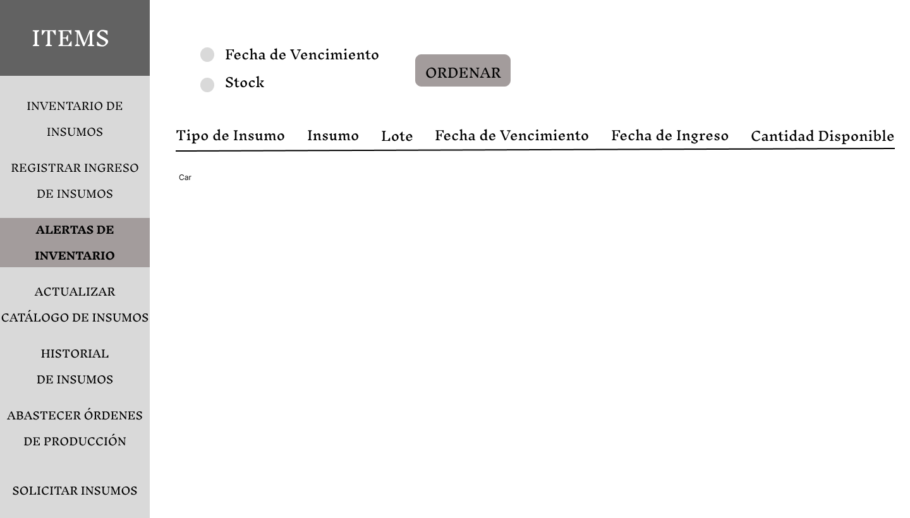
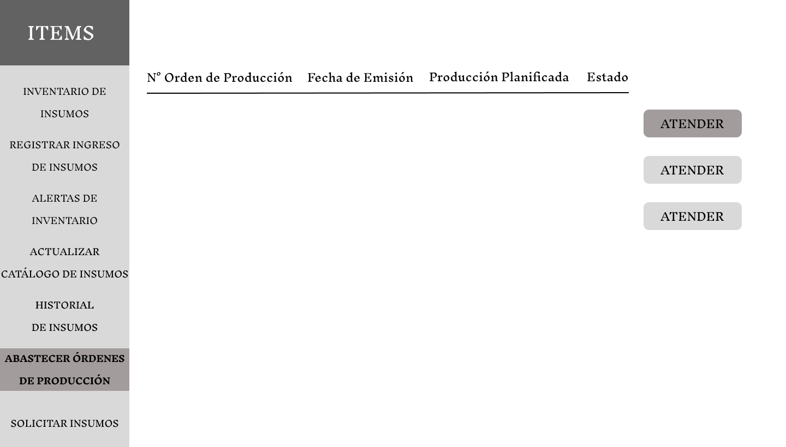
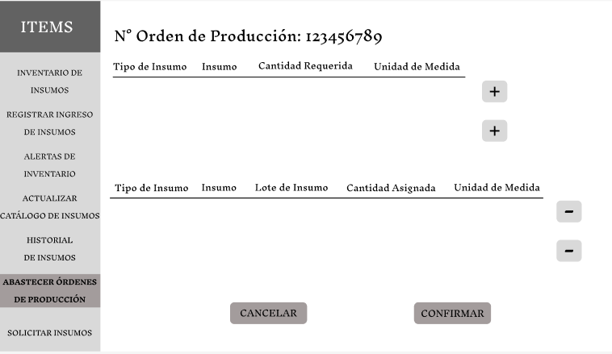
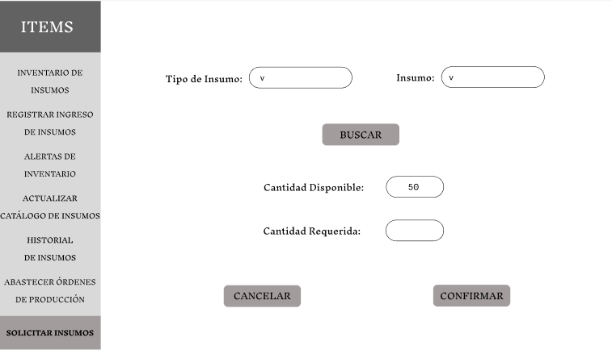
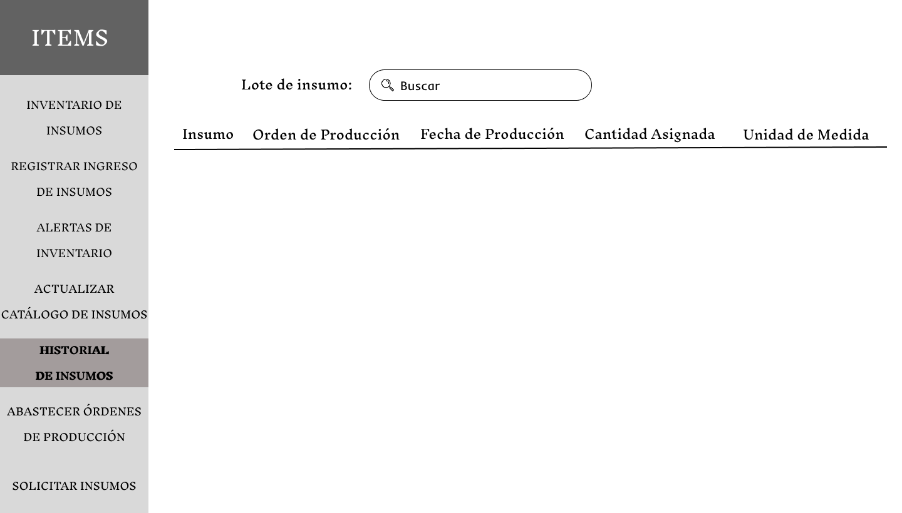

# 3.2. Módulo de Almacen de Insumos 

## **Caso de uso #1: Registrar ingreso de isnsumo**

| **ID**               | CU-01                                                                   |
|----------------------|-------------------------------------------------------------------------|
| **Actor(es)**        | Encargado de Almacen                                            |
| **Descripción**      | Registrar nuevos insumos recibidos de proveedores, validando su información básica y asignando ubicación FIFO.           |
| **Precondiciones**   | El usuario debe estar logueado y los insumos deben estar físicamente en el área de recepción.           |
| **Flujo Principal**  | 1. El usuario ingresa el tipo de insumo y el nombre del insumo    2. El registra el numero de lote, RUC del proveedor y cantidad del insumo    3. Asignar ubicación FIFO sugerida por sistema.   4. El usuario confirma el registro del insumo. |
| **Requerimientos Especiales** | LLegada de nuevos insumos del proveedor.    |
| **Frecuencia de Uso**| Frecuentemente, depende de la demanda.    

## *Prototipo:*

## **Caso de uso #2: Generar alertas de stock minimo**

| **ID**               | CU-02                                                                   |
|----------------------|-------------------------------------------------------------------------|
| **Actor(es)**        | Sistema ---> Logistica                                            |
| **Descripción**      | Notificar automáticamente cuando el stock de un insumo alcance su nivel mínimo configurado.           |
| **Precondiciones**   | El reporte historicos debe estar actualizado.           |
| **Flujo Principal**  | 1. Sistema verifica stock diariamente de cada insumo.    2. Si stock ≤ mínimo, activa alerta para el area de logistica.   3.  Envía notificación a el area de Logística.   4. El usuario confirma el registro del insumo. |
| **Requerimientos Especiales** | Consumo constante de insumos.    |
| **Frecuencia de Uso**| variable, segun la demanda del area de produccion.    

## *Prototipo:*

## **Caso de uso #3:  Abastecer Órdenes de Producción (FIFO)**

| **ID**               | CU-03                                                                   |
|----------------------|-------------------------------------------------------------------------|
| **Actor(es)**        | Encargados de almacen y produccion                                            |
| **Descripción**      | Despachar insumos a producción priorizando lotes más antiguos y cercanos a vencer.          |
| **Precondiciones**   | Ordenes de produccion pendientes y suficiente stock.           |
| **Flujo Principal**  | 1. El encargado de produccion realiza una orden de produccion.    2. El sistema seleciona cada insumo mediante FIFO   3.  El encargado de alamacen registra la salida de los insumos requeridos.   4. El sistema acctualiza automaticamente el inventario. |
| **Requerimientos Especiales** | Solicitudes de ordenes de produccion.    |
| **Frecuencia de Uso**| variable, segun la demanda del area de produccion.    

## *Prototipo:*

## **Caso de uso #4:  Generar solicitud de insumos**

| **ID**               | CU-04                                                                   |
|----------------------|-------------------------------------------------------------------------|
| **Actor(es)**        | Encargados de almacen                                           |
| **Descripción**      | Generar solicitud de insumos cuando el stock es insuficiente, hay alertas activa o demanda de ordenes de produccion.         |
| **Precondiciones**   | Alertas de stock minimo. |
| **Flujo Principal**  | 1. El encargado del almacen ingresa el tipo de insumo y nombre del insumo.    2. El usuario asigna la cantidad requerida.   3.  el usuario confirma la solicitud y se envia una notificacion al area de logistica. |
| **Requerimientos Especiales** | Falta de insumos segun la alerta de stock minimo.    |
| **Frecuencia de Uso**| media, segun el historial del inventario.    

## *Prototipo:*

## **Caso de uso #5:  Generar historial de insumos**

| **ID**               | CU-05                                                                 |
|----------------------|-------------------------------------------------------------------------|
| **Actor(es)**        | Encargados de almacen                                           |
| **Descripción**      | Consultar el registro histórico de entradas, salidas y ajustes de insumos para verificar trazabilidad o analizar consumos.        |
| **Precondiciones**   | Existencia de movimientos registrados en el sistema. |
| **Flujo Principal**  | 1. El usuario selecciona "Historial de Insumos" en el menú.    2. El sistema muestra filtros configurables como: lote de insumo   3.  El usuario aplica los filtros requeridos segun su necesidad.   4.El sistema genera el reporte y el usuario puede ver mas detalles al hacer click.|
| **Requerimientos Especiales** | Los moviminetos deben estar cargados con anterioridad.    |
| **Frecuencia de Uso**| media, depende del area de almacen.    

## *Prototipo:*
