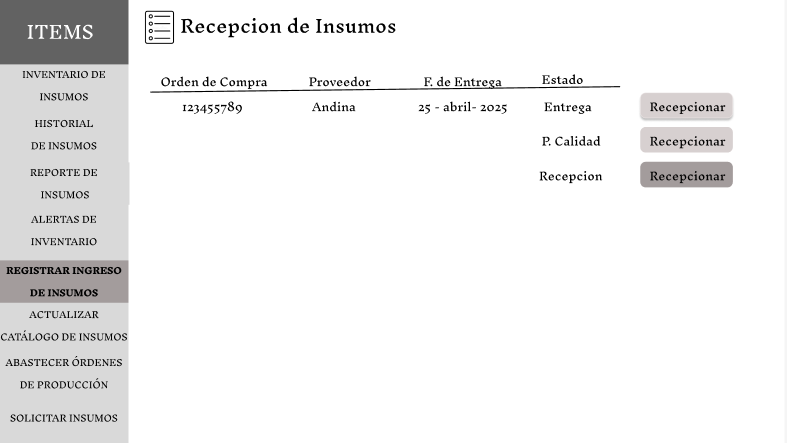
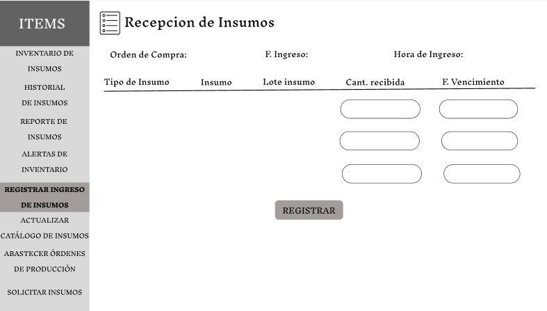
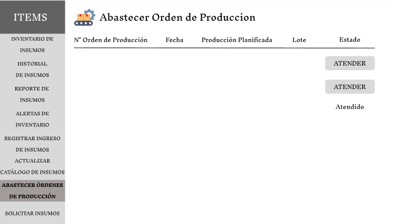
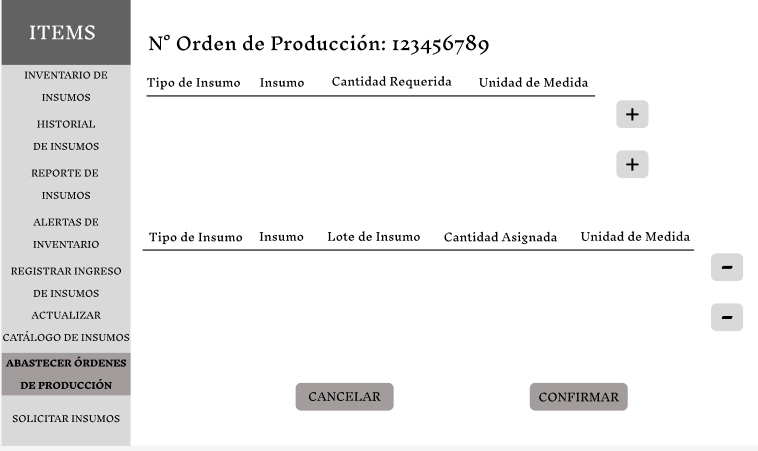
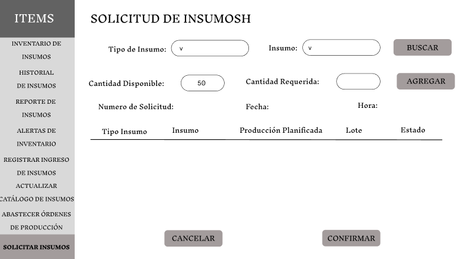
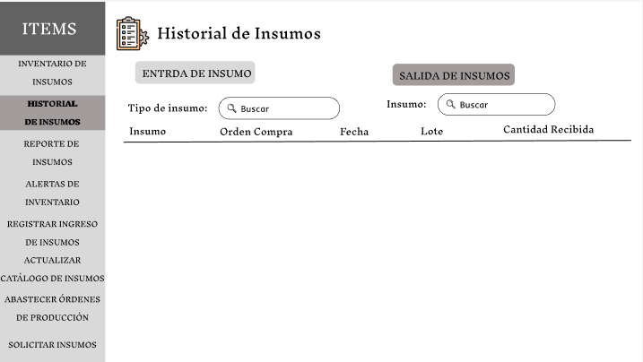
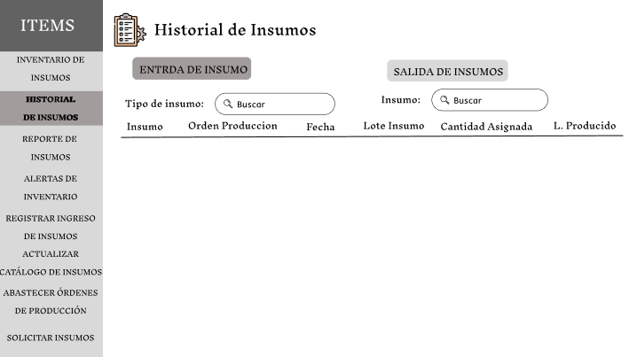

# 3.2. Módulo de Almacen de Insumos 

## **Caso de uso #1: Registrar ingreso de isnsumo**

| **ID**               | CU-01                                                                   |
|----------------------|-------------------------------------------------------------------------|
| **Actor(es)**        | Operarrio  de Almacen                                            |
| **Descripción**      | Registrar nuevos insumos recibidos de proveedores, validando su información básica y asignando ubicación FIFO.           |
| **Precondiciones**   | Una compra de isnumos del area de compras y haber sido aprobado por el area de calidad.           |
| **Flujo Principal**  | 1. El usuario observa la pantalla de ordenes de compra relizada    2. Si el estado es recepcionar de la oreden de compra. Entonces el ususario al darel clivk ingresa a los detalles de la orden de compras.   3. El sistema preresgistra el empleado quien realiza la recepcion, la fecha y la hora.   4. El usuario ingresa la catidad recibida y la echa de vencimiento de cada insumo.   5. El usuario resgistra la recepcion y el sistema actualiza el inventario. |
| **Requerimientos Especiales** | LLegada de nuevos insumos del proveedor.    |
| **Frecuencia de Uso**| Frecuentemente, depende de la demanda.    

## *Prototipo:*

## **Caso de uso #2: Generar alertas de stock minimo y Fecha de Vencimiento**

| **ID**               | CU-02                                                                   |
|----------------------|-------------------------------------------------------------------------|
| **Actor(es)**        | Sistema ---> Almacen                                            |
| **Descripción**      | Notificar automáticamente cuando el stock de un insumo alcance su nivel mínimo configurado.           |
| **Precondiciones**   | El reporte de insumos debe estar actualizado.           |
| **Flujo Principal**  | 1. Sistema verifica stock diariamente de cada insumo y la fecha de vencimiento.    2. Si stock ≤ mínimo o F. vencimiento, activa alerta para el area del Almacen.   3.  El ususario pude abrir el apartado de alertas y filtrar por tipo de alerta .   4. El usuario segun esa informacion puede realizar una solicitud. |
| **Requerimientos Especiales** | Consumo constante de insumos.    |
| **Frecuencia de Uso**| variable, segun la demanda del area de produccion.    

## *Prototipo:*

## **Caso de uso #3:  Abastecer Órdenes de Producción (FIFO)**

| **ID**               | CU-03                                                                   |
|----------------------|-------------------------------------------------------------------------|
| **Actor(es)**        | Operario de almacen y produccion                                            |
| **Descripción**      | Despachar insumos a producción priorizando lotes más antiguos y cercanos a vencer.          |
| **Precondiciones**   | Ordenes de produccion pendientes y suficiente stock.           |
| **Flujo Principal**  | 1. El ingresa a la pantalla de abstecer insumos y observa las ordenes de produccion.    2. El usuario atiende a la orden de produccion.   3.  El usuario ve a detalle los insumos solicitados por la orden de produccion.   4. El sistema pudede asignar automaticamente los insumos o el usuario lo puede asignar.   5. El usuario confirma la salida de insumos y el sistema actualiza el inventario. |
| **Requerimientos Especiales** | Solicitudes de ordenes de produccion.    |
| **Frecuencia de Uso**| variable, segun la demanda del area de produccion.    

## *Prototipo:*

## **Caso de uso #4:  Generar solicitud de insumos**

| **ID**               | CU-04                                                                   |
|----------------------|-------------------------------------------------------------------------|
| **Actor(es)**        | Operario de almacen                                           |
| **Descripción**      | Generar solicitud de insumos cuando el stock es insuficiente, hay alertas activa o demanda de ordenes de produccion.         |
| **Precondiciones**   | Alertas de stock minimo o ordenes de produccion planificadas. |
| **Flujo Principal**  | 1. El usuario ingresa el tipo de insumo y nombre del insumo para realizar la busqueda.    2. El usuario agrega los insumos requeridos.   3.  el usuario confirma la solicitud de insumos.   4. El sistema registra la hora y la fecha de la solicitud de insumos.    5. El sistema envia una norificacion de la solicitud al area de compras.|
| **Requerimientos Especiales** | Falta de insumos segun la alerta de stock minimo.    |
| **Frecuencia de Uso**| media, segun el historial del inventario.    

## *Prototipo:*

## **Caso de uso #5:  Generar historial de insumos**

| **ID**               | CU-05                                                                 |
|----------------------|-------------------------------------------------------------------------|
| **Actor(es)**        | Operario de almacen                                           |
| **Descripción**      | Consultar el registro histórico de entradas, salidas y ajustes de insumos para verificar trazabilidad o analizar consumos.        |
| **Precondiciones**   | Existencia de movimientos registrados en el sistema. |
| **Flujo Principal**  | 1. El usuario selecciona "Historial de Insumos" en el menú.    2. El sistema muestra filtros principales y secundarios como: tipo insumo, insumo.   3.  El usuario aplica los filtros requeridos segun su necesidad.   4.El usuario puede ver mas detalles al hacer click.|
| **Requerimientos Especiales** | Los moviminetos deben estar cargados con anterioridad.    |
| **Frecuencia de Uso**| media, depende del area de almacen.    

## *Prototipo:*

