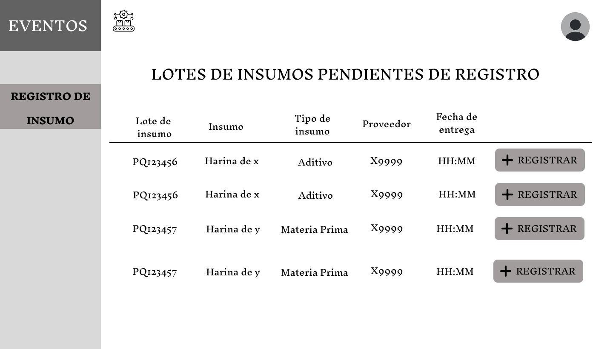
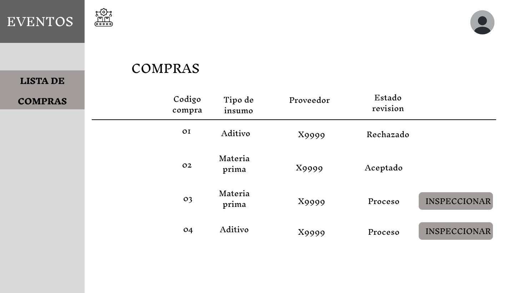
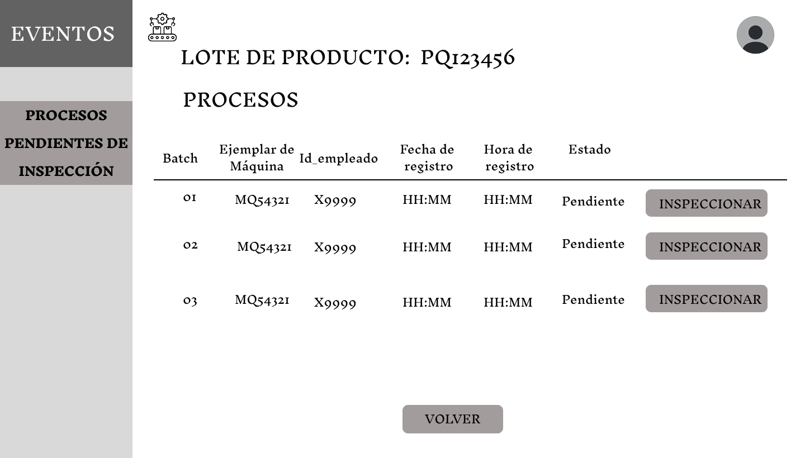

# **3.3. Módulo de Control de Calidad**

## **Caso de uso #1: Registrar Lote de Insumo Recibido en Calidad**

| **ID**               | CU-01                                                                   |
|----------------------|-------------------------------------------------------------------------|
| **Actor(es)**        | Inspector de Calidad                                         |
| **Descripción**      | Registrar la llegada de un lote de insumo al laboratorio para que pueda ser inspeccionado posteriormente.         |
| **Precondiciones**   | 1. La compra debe estar registrada.   2. El lote debe haber llegado físicamente al laboratorio.        |
| **Flujo Principal**  | 1. El inspector accede a la pantalla “Lotes Pendientes de Registro en Calidad”.   2. Selecciona el lote de insumo recibido.    3. Ingresa la Fecha y Hora de ingreso al laboratorio.   4. Confirma el registro.
| **Requerimientos Especiales** | Los datos de compra deben estar sincronizados con el módulo de compras.    |
| **Frecuencia de Uso**| Por cada lote que llega a calidad, incluso reposiciones.                  |

### **Flujo Principal:**
1. El inspector accede a la pantalla “Lotes Pendientes de Registro en Calidad”.

2. Selecciona el lote de insumo recibido.
3. Ingresa la Fecha y Hora de ingreso al laboratorio.
4. Confirma el registro.

## **Caso de uso #2: Inspeccionar Lotes de Insumos**

| **ID**               | CU-02                                                                   |
|----------------------|-------------------------------------------------------------------------|
| **Actor(es)**        | Inspector de Calidad                                       |
| **Descripción**      | Inspeccionar los lotes de insumo ya registrados en el laboratorio y registrar el resultado de su evaluación.          |
| **Precondiciones**   | 1. El lote debe estar registrado en calidad.   2. Debe estar en estado "pendiente".   |
| **Flujo Principal**  | 1. Acceder a la pantalla “Compras”.    2. Seleccionar una compra en estado "Proceso" y ver los lotes de insumos.    3. Visualizar sus lotes asociados en estado “Pendiente”.    4. Registrar el resultado: Aprobado o Rechazado, con comentarios y adjuntos.   5. Confirmar y guardar inspección.   |
| **Requerimientos Especiales** | El sistema debe actualizar el estado general de la compra según los resultados de los lotes. |
| **Frecuencia de Uso**| Cada vez que se inspecciona una compra nueva o una reposición.                     |

### **Flujo Principal:**
1. Acceder a la pantalla “Compras”.
2. Seleccionar una compra en estado "Proceso" y ver los lotes de insumos.

3. Visualizar sus lotes asociados en estado “Pendiente”.

4. Registrar el resultado: Aprobado o Rechazado, con comentarios y adjuntos.
5. Confirmar y guardar inspección.

## **Caso de uso #3: Visualizar Lotes Inspeccionados (Revisados)**

| **ID**               | CU-03                                                                   |
|----------------------|-------------------------------------------------------------------------|
| **Actor(es)**        | Inspector de Calidad                                       |
| **Descripción**      | Consultar el estado y detalle de los lotes de insumo ya inspeccionados (revisados).          |
| **Precondiciones**   | Deben existir inspecciones ya registradas.   |
| **Flujo Principal**  | 1. Acceder a la pantalla “Lotes Revisados”.    2. Visualizar tabla con información del lote de insumo inspeccionado    3. Hacer click en [Ver detalle] para ver información adicional.   |
| **Requerimientos Especiales** | Ver historial consolidado por compra. |
| **Frecuencia de Uso**| Cada vez que se desea ver la trazabilidad de los estados del lote de insumo        |

### **Flujo Principal:**
1. Acceder a la pantalla “Lotes Revisados”.
2. Visualizar tabla con información del lote de insumo inspeccionado
3. Hacer click en [Ver detalle] para ver información adicional.

## **Caso de uso #4: Inspeccionar Proceso Productivo por Etapa (Mezclado, Moldeado y Secado)**

| **ID**               | CU-03                                                                   |
|----------------------|-------------------------------------------------------------------------|
| **Actor(es)**        | Inspector de Calidad                                         |
| **Descripción**      | Validar la calidad del proceso en etapas como mezclado, moldeado o secado, inspeccionando los ejemplares de máquina utilizados.             |
| **Precondiciones**   | El proceso debe haberse registrado por los operarios en el sistema.       |
| **Flujo Principal**  | 1. Acceder a la pantalla "Lista de Lotes de Producto".    2. Seleccionar un lote en etapa intermedia (mezclado, moldeado, secado).    3. Ver los procesos por ejemplar de máquina.   4. Inspeccionar los que estén en estado "Pendiente".    5. Registrar: ID Inspector, Estado, Tipo de fallo, Cantidad perdida, Comentarios, Adjuntos.  |
| **Requerimientos Especiales** | El sistema debe calcular el estado general de la etapa según el resultado de los procesos.   |
| **Frecuencia de Uso**| Por lote que pasa por cada etapa del proceso.         |

### **Flujo Principal:**
1. Acceder a la pantalla "Lista de Lotes de Producto".
2. Seleccionar un lote en etapa intermedia (mezclado, moldeado, secado).

3. Ver los procesos por ejemplar de máquina.

4. Inspeccionar los que estén en estado "Pendiente".
5. Registrar: ID Inspector, Estado, Tipo de fallo, Cantidad perdida, Comentarios, Adjuntos.

## **Caso de uso #5: Inspeccionar Etapa de Envasado**

| **ID**               | CU-04                                                                   |
|----------------------|-------------------------------------------------------------------------|
| **Actor(es)**        | Inspector de Calidad          |
| **Descripción**      | Evaluar la calidad de los productos en la etapa de envasado, registrando posibles envases defectuosos.             |
| **Precondiciones**   | El lote de producto debe haber llegado a la etapa de envasado.     |
| **Flujo Principal**  | 1. Acceder a la pantalla "Lotes de Producto" y seleccionar un lote en etapa "Envasado".    2. Ingresar: ID Inspector, Cantidad de envases defectuosos, Comentarios, Adjuntos.    3. Confirmar la inspección.   |
| **Requerimientos Especiales** | Se debe registrar el porcentaje de defectos por lote.   |
| **Frecuencia de Uso**| Cada vez que un lote llega a envasado           |

### **Flujo Principal:**
1. Acceder a la pantalla "Lotes de Producto" y seleccionar un lote en etapa "Envasado".
2. Ingresar: ID Inspector, Cantidad de envases defectuosos, Comentarios, Adjuntos.
3. Confirmar la inspección.

## **Caso de uso #6: Inspeccionar Picking**

| **ID**               | CU-05                                                                   |
|----------------------|-------------------------------------------------------------------------|
| **Actor(es)**        | Inspector de Calidad                                     |
| **Descripción**      | Revisar el picking realizado antes del despacho para asegurar que los empaques estén correctos.         |
| **Precondiciones**   | Debe existir un registro de picking pendiente de inspección.     |
| **Flujo Principal**  | 1. Acceder a la pantalla "Lista de Pickings".    2. Seleccionar picking pendiente.    3. Ingresar: ID Inspector, Cantidad Observada (empaques defectuosos), Comentarios, Adjuntos.    4. Si hay defectos, se notifica a picking y se crea nuevo ID_Picking.      5. Si está correcto, se aprueba para distribución.  |
| **Requerimientos Especiales** | Identificación de registros duplicados por mismo Código_Picking.   |
| **Frecuencia de Uso**| Por cada picking pendiente.             |

### **Flujo Principal:**
1. Acceder a la pantalla "Lista de Pickings".
2. Seleccionar picking pendiente.

4. Ingresar: ID Inspector, Cantidad Observada (empaques defectuosos), Comentarios, Adjuntos.

5. Si hay defectos, se notifica a picking y se crea nuevo ID_Picking.
6. Si está correcto, se aprueba para distribución.

## **Caso de uso #7: Consultar Historial de Inspecciones**

| **ID**               | CU-06                                                                   |
|----------------------|-------------------------------------------------------------------------|
| **Actor(es)**        | Inspector de Calidad                                     |
| **Descripción**      | Permite visualizar y filtrar todas las inspecciones realizadas a lo largo del proceso (insumos, producción, envasado y picking) para fines de trazabilidad, auditoría y control         |
| **Precondiciones**   | El usuario debe estar autenticado en el sistema. Deben existir registros de inspecciones previas.     |
| **Flujo Principal**  | 1. El usuario accede a la opción "Historial de Inspecciones".    2. Selecciona filtros como tipo de inspección, rango de fechas, estado o inspector.    3. El sistema muestra una tabla con resultados según los filtros aplicados.   4. El usuario puede hacer clic en "Ver Detalle" para acceder a la información completa de una inspección.  |
| **Requerimientos Especiales** | Identificación de registros duplicados por mismo Código_Picking.   |
| **Frecuencia de Uso**| Por cada picking pendiente.  |

### **Flujo Principal:**
1. El usuario accede a la opción "Historial de Inspecciones".
2. Selecciona filtros como tipo de inspección, rango de fechas, estado o inspector.
3. El sistema muestra una tabla con resultados según los filtros aplicados.
4. El usuario puede hacer clic en "Ver Detalle" para acceder a la información completa de una inspección.

