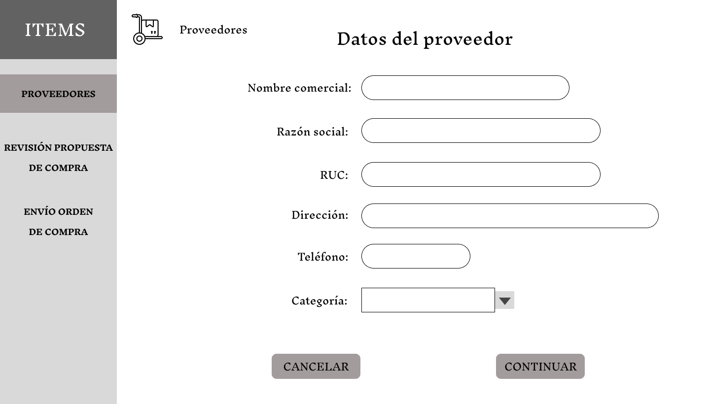
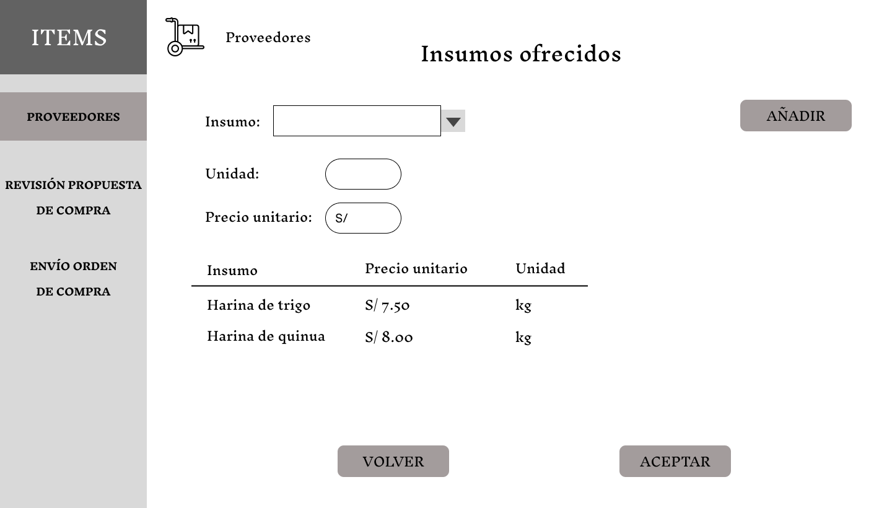

# 3.4 Módulo de Compras

## **Caso de uso #1: Registrar Proveedor e Insumos que Ofrece**

| **ID**               | CU-501                                                                   |
|----------------------|-------------------------------------------------------------------------|
| **Actor(es)**        | Jefe de Compras                                            |
| **Descripción**      | Permite al jefe de compras registrar nuevos proveedores, junto con los insumos que ofrecen, incluyendo datos como nombre, RUC, contacto, categoría, insumo y precio unitario.          |
| **Precondiciones**   | El usuario debe estar logueado en el sistema.           |
| **Flujo Principal**  | 1. Selecciona el item "PROVEEDORES".   2. Inicia un nuevo registro de proveedor.   3. Ingresa los datos principales del proveedor.    4. Selecciona la categoría a la que pertenece.   5. Registra los insumos que ofrece y sus precios unitarios.    6. Finaliza el registro del proveedor.    7. El sistema actualiza la tabla de proveedores. |
| **Requerimientos Especiales** | Formulario completo con validación de campos.    |
| **Frecuencia de Uso**| Poco frecuente, cuando hay un nuevo proveedor o insumo que ofrece.   |

## *Prototipo:*
### En el item PROVEEDORES

1. Se selecciona el botón "REGISTRAR" para iniciar el registro de un nuevo proveedor, puede ser con previo contacto a este.
---

---

2. Se ingresa los datos principales del proveedor y se selecciona la categoría a la que pertenece, luego se selecciona el boton "CONTINUAR".
---

---

3. Cada vez que se quiera registrar un insumo, se selecciona cual y se registra su precio unitario y unidad de medida. Luego se selecciona el botón "AÑADIR" para guardarlo en la tabla. Por último, se selecciona el botón "ACEPTAR" cuando se hallan registrado todos los insumos que ofrece el proveedor.
---

---

## **Caso de uso #2: Atender Solicitud de Abastecimiento**

| **ID**               | CU-502                                                                   |
|----------------------|-------------------------------------------------------------------------|
| **Actor(es)**        | Operario de Compras                                            |
| **Descripción**      | Permite al operario revisar las solicitudes de abastecimiento realizadas por el área de almacén, según las cantidades que requiera para el abastecimiento del stock mínimo.          |
| **Precondiciones**   | El usuario debe estar logueado en el sistema y debe haber solicitudes de abastecimiento pendientes.           |
| **Flujo Principal**  | 1. Selecciona el item "SOLICITUD DE ABASTECIMIENTO".   2. Inicia la revisión de la solicitud.   3. Recibe detalles de los insumos solicitados.   4. El sistema registra la solicitud como atendida. |
| **Requerimientos Especiales** | Existencia previa de solicitudes generadas desde almacén.    |
| **Frecuencia de Uso**| Frecuente, según rotación de inventario.   |

## *Prototipo:*
### En el item SOLICITUD DE ABASTECIMIENTO

1. Se selecciona el botón "VER" para iniciar la revisión de la solicitud de abastecimiento.
---

---

2. Se recibe detalles acerca de los insumos solicitados, como la cantidad y su unidad. Luego se selecciona el boton "ACEPTAR" para registrar la solicitud como atendida.
---

---

## **Caso de uso #3: 	Realizar Planificación de Compra**

| **ID**               | CU-503                                                                   |
|----------------------|-------------------------------------------------------------------------|
| **Actor(es)**        | Operario de Compras                                            |
| **Descripción**      | Permite al operario planificar la compra en base a las solicitudes de abastecimiento, elige el proveedor más conveniente y genera una propuesta de compra.          |
| **Precondiciones**   | Solicitudes atendidas con insumos pendientes a abastecer.           |
| **Flujo Principal**  | 1. Selecciona el item "PLANIFICACIÓN DE COMPRA".   2. Selecciona a que tipo de insumo realizar la planificación.   3. Selecciona el proveedor más conveniente.   4. Llena la tabla según los precios del proveedor.   5. Aplica algún descuento ofrecido pore el proveedor.   6. Registra la fecha y hora acordada de entrega.   7. El sistema registra una nueva propuesta de compra. |
| **Requerimientos Especiales** | Comparación de precios y tiempos de entrega.    |
| **Frecuencia de Uso**| Frecuente, dependiendo de las solicitudes activas.   |

## *Prototipo:*
### En el item PLANIFICACIÓN DE COMPRA

1. Se selecciona el tipo de insumo que se desee realizar su planificación de compra.
---

---

2. Se selecciona el proveedor mas conveniente, se selecciona el botón "LLENAR" para comparar el monto total según el precio unitario de insumo y su cantidad requerida, luego se selecciona el botón "APLICAR" si existe algún descuento previamente acordado con el proveedor y así modificar el monto total a pagar. Por último, se selecciona el botón "ENVIAR" para registrar una nueva propuesta de compra.
---

---

## **Caso de uso #4: 	Revisar Propuesta de Compra**

| **ID**               | CU-504                                                                   |
|----------------------|-------------------------------------------------------------------------|
| **Actor(es)**        | Jefe de Compras                                            |
| **Descripción**      | Permite al jefe revisar la planificación hecha por el operario y decidir si se aprueba o rechaza.          |
| **Precondiciones**   | Existencia de propuestas de compra generadas.           |
| **Flujo Principal**  | 1. Selecciona el item "REVISIÓN PROPUESTA DE COMPRA".   2. Selecciona la propuesta de compra pendiente.   3. Recibe detalles de la propuesta de compra.   4. Aprueba la propuesta de compra.   5. El sistema registra una nueva orden de compra.   6. Envia la orden de compra al área de finanzas para que realice el pago.    7. Una vez pagada, se genera un nuevo proceso de seguimiento de compra.|
| **Requerimientos Especiales** | Sistema debe mantener registro de decisiones.    |
| **Frecuencia de Uso**| Frecuente, según flujo de compras.   |

## *Prototipo:*
### En el item REVISIÓN PROPUESTA DE COMPRA

1. Se selecciona el botón "VER" para visualizar los detalles de la propuesta de compra pendiente.
---

---

2. Se reciben los detalles acerca de la propuesta de compra, luego el jefe selecciona el botón "ACEPTAR" para registrar una nueva orden de compra, pero en caso de no estar de acuerdo, se selecciona el botón "RECHAZAR" para devolver los datos de insumos solicitados a planificación de compra.
---

---

### En el item ENVÍO ORDEN DE COMPRA

1. Se selecciona el botón "ENVIAR" para mandar la orden de compra al área de finanzas para que realice el pago, luego de hacerlo, el estado de orden de compra se actualiza como pagado y a su vez, se genera un nuevo proceso de seguimiento de compra.
---

---

## **Caso de uso #5: Controlar seguimiento de Compra**

| **ID**               | CU-505                                                                   |
|----------------------|-------------------------------------------------------------------------|
| **Actor(es)**        | Operario de Compras                                            |
| **Descripción**      | El operario recibe físicamente los lotes de insumos del proveedor, verifica los tiempos de entrega y los envía al área de calidad para asegurar que cumplan con sus estándares respectivos.          |
| **Precondiciones**   | Orden de compra pagada y entrega de compra programada.           |
| **Flujo Principal**  | 1. Selecciona el item "SEGUIMIENTO DE COMPRA".   2. Controla el seguimiento de la compra recibida.   3. Registra los lotes de insumos comprados.   4. Registra la fecha y hora de la compra recibida.   5. Actualiza el estado de la compra.|
| **Requerimientos Especiales** | Registro de fecha de recepción y lotes recibidos.    |
| **Frecuencia de Uso**| Frecuente, cada vez que llegan pedidos.   |

## *Prototipo:*
### En el item SEGUIMIENTO DE COMPRA

1. Se selecciona el botón "VER" para controlar el seguimiento de la compra recibida.
---

---

2. Se registran los lotes de insumos comprados, también se compara la fecha y hora a la que fue entregada con la acordada. Por último, se selecciona el botón "ACEPTAR" para actualizar el estado de la compra.
---

---

## **Caso de uso #6: 	Atender Lotes Rechazados**

| **ID**               | CU-506                                                                   |
|----------------------|-------------------------------------------------------------------------|
| **Actor(es)**        | Operario de Compras                                            |
| **Descripción**      | Si el área calidad rechaza un lote, el operario gestiona el reclamo con el proveedor para reposición del lote de insumo rechazado o devolución del dinero.          |
| **Precondiciones**   | Evaluación negativa del área de calidad.           |
| **Flujo Principal**  | 1. Selecciona el item "ATENCIÓN DE LOTES RECHAZADOS".   2. Inicia con el reclamo del lote rechazado.   3. Recibe detalles del motivo de rechazo.   4. Especifica el objetivo del reclamo.   5. Envia el reclamo formal al proveedor.   6. El sistema actualiza el estado del reclamo como "En proceso".   7. Actualiza el estado del reclamo según respuesta del proveedor.   El sistema marca el estado de reclamo como "Resuelto".|
| **Requerimientos Especiales** | Registro de comunicación con proveedor.    |
| **Frecuencia de Uso**| Poco frecuente, depende de la calidad de los insumos.   |

## *Prototipo:*
### En el item ATENCIÓN DE LOTES RECHAZADOS

1. Se selecciona el botón "VER" para iniciar con el reclamo del lote rechazado por el área de calidad.
---

---

2. Se recibe los detalles del motivo de rechazo, como las observaciones notadas durante la revisión y fotos adjuntas como prueba. Luego, se selecciona el objetivo del reclamo para enviarle un reclamo formal al proveedor. Por último, se actualiza el estado del reclamo como "En proceso".
---

---

3. En caso de que el proveedor realice la reposición del lote de insumo, se registra nuevamente el lote, como también la fecha y hora. Luego se envia el lote al área de calidad. Por último, se actualiza el estado del reclamo como "Resuelto".
---

---

4. En caso de que el proveedor realice la devolución del dinero, se recibe la cantidad de dinero correspondiente a devolver, como también la fecha y hora. Por último, se actualiza el estado del reclamo como "Resuelto".
---

---