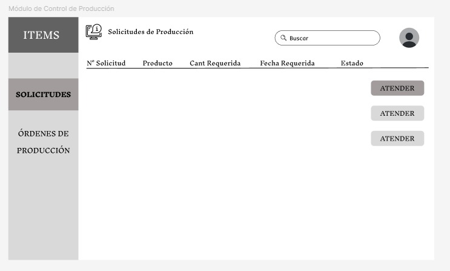
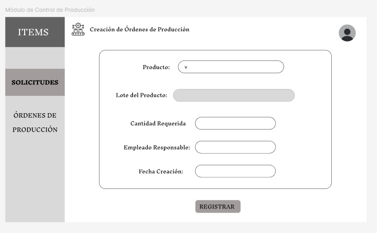
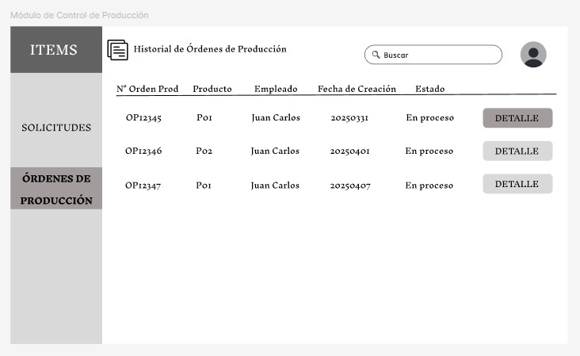
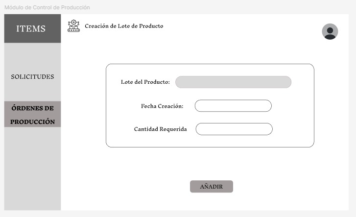
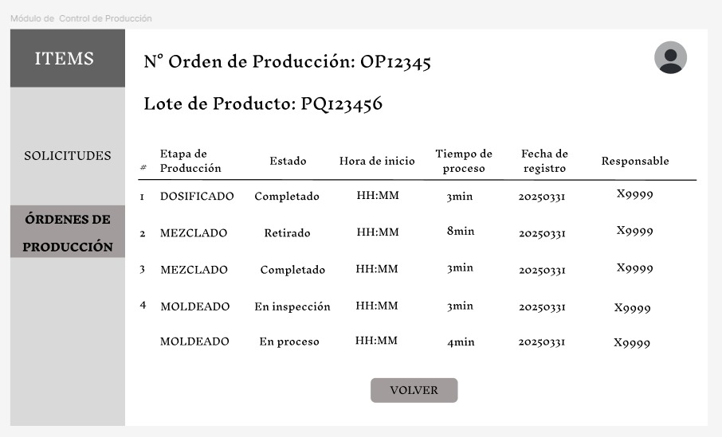

# 3.5.1 Módulo de Control de Producción 

## **Caso de uso #1: Visualizar solicitudes de producción**

| **ID**               | CU-01                                                                   |
|----------------------|-------------------------------------------------------------------------|
| **Actor(es)**        | Jefe de Producción                                            |
| **Descripción**      | Permite al jefe de producción consultar las solicitudes de producción generadas por el área de almacén de productos, visualizando número de solicitud, producto, cantidad, fecha requerida y estado.          |
| **Precondiciones**   | El usuario debe estar logueado en el sistema.           |
| **Flujo Principal**  | 1. El usuario accede al módulo de producción    2. Selecciona la opción "Solicitudes".    3. El sistema muestra la lista de solicitudes con sus respectivos detalles.  |
| **Requerimientos Especiales** | Existencia previa de solicitudes registradas.    |
| **Frecuencia de Uso**| Frecuentemente, depende de la demanda de la producción.   |

## *Prototipo:*

## **Caso de uso #2: Generar órdenes de producción**

| **ID**               | CU-02                                                                   |
|----------------------|-------------------------------------------------------------------------|
| **Actor(es)**        | Jefe de Producción                                            |
| **Descripción**      | Crear nuevas órdenes de producción a partir de las solicitudes del almacén.         |
| **Precondiciones**   | Debe existir una solicitud de producción.           |
| **Flujo Principal**  | 1. El usuario atiende una solicitud.    2. Ingresa datos como producto, cantidad requerida, empleado responsable y la fecha de creación.   3. Genera la orden de producción.  |
| **Requerimientos Especiales** | Validación de disponibilidad de recursos.   |
| **Frecuencia de Uso**| Frecuentemente, según las solicitudes recibidas.  |   

## *Prototipo:*

## **Caso de uso #3:  Generar historial de órdenes de producción**

| **ID**               | CU-03                                                                   |
|----------------------|-------------------------------------------------------------------------|
| **Actor(es)**        | Jefe de Producción                                            |
| **Descripción**      | Consultar el historial de órdenes de producción, con detalles como fecha de creación, empleado responsable, producto y estado         |
| **Precondiciones**   | Se debe haber creado una orden de producción          |
| **Flujo Principal**  | 1. El usuario accede a la opción "Órdenes de producción".    2. Busca órdenes según filtros.   3.  Visualiza información general de la orden de producción.  |
| **Requerimientos Especiales** | Solicitudes de ordenes de produccion.    |
| **Frecuencia de Uso**| variable, segun la demanda del area de produccion.   |  

## *Prototipo:*

## **Caso de uso #4:  Visualizar detalles de cada orden de producción**

| **ID**               | CU-04                                                                   |
|----------------------|-------------------------------------------------------------------------|
| **Actor(es)**        | Jefe de Producción                                           |
| **Descripción**      | Permite ver información específica de una orden en ejecución o finalizada, incluyendo cantidad requrida, nombre del producto y fechas planficadas. A su vez se visualiza la lista de lotes de producto que contiene la orden de produción.      |
| **Precondiciones**   | La orden de producción debe existir en el sistema. |
| **Flujo Principal**  | 1. El ususario selecciona la opción "Detalles".    2. Visualiza información específica de la orden de producción y los lotes de producto correspondientes.   |
| **Requerimientos Especiales** | Actualización en tiempo real de avances.    |
| **Frecuencia de Uso**| Frecuente, especialmente durante el monitoreo.    |

## *Prototipo:*

## **Caso de uso #5:  Añadir lote producto**

| **ID**               | CU-05                                                                 |
|----------------------|-------------------------------------------------------------------------|
| **Actor(es)**        | Jefe de Producción                                           |
| **Descripción**      | Registrar nuevos lotes de producto en base a la modificación de una orden debido a un fallo en el proceso de producción, asignando fechas y cantidades requerida.        |
| **Precondiciones**   | Existencia de un lote de producto inicial |
| **Flujo Principal**  | 1. El usuario selecciona la opción "Añadir Lote".    2. Ingresa datos del lote como la cantidad requerida y la fecha de creación.    3.  Se añade el nuevo lote de producto.  |
| **Requerimientos Especiales** | El lote añadido debe pertenecer a la misma orden de producción que el anterior lote.    |
| **Frecuencia de Uso**| media, depende de los fallos que hayan en los procesos de producción.     |

## *Prototipo:*

## **Caso de uso #6:  Visualizar detalle de lote de producto**

| **ID**               | CU-06                                                                 |
|----------------------|-------------------------------------------------------------------------|
| **Actor(es)**        | Jefe de Producción                                           |
| **Descripción**      | Permite consultar la información detallada de un lote de producto, incluyendo las etapas del proceso productivo, responsables, tiempos y estado de cada una.        |
| **Precondiciones**   |El lote debe estar registrado en el sistema. |
| **Flujo Principal**  | 1. El usuario selecciona la opción "Detalles" de la lista de lotes   2. El sistema muestra información como: etapas realizadas, responsables por etapa, tiempo empleado y estado actual del lote.   |
| **Requerimientos Especiales** | 	Registro detallado por etapa del proceso de producción.    |
| **Frecuencia de Uso**| Frecuente, especialmente para seguimiento y monitoreo interno.    |

## *Prototipo:*
