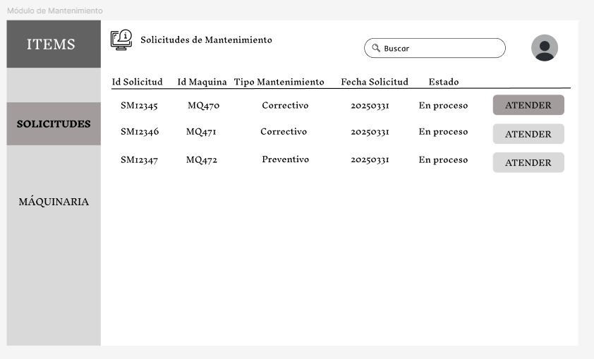
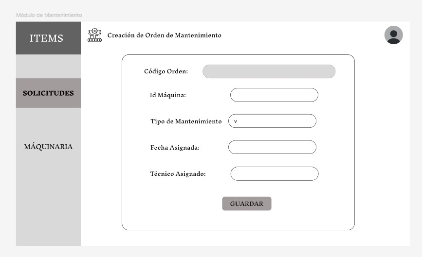
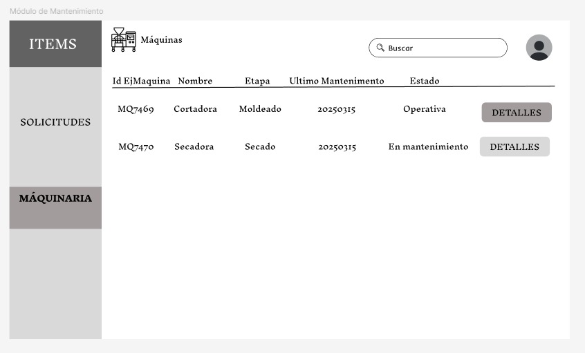
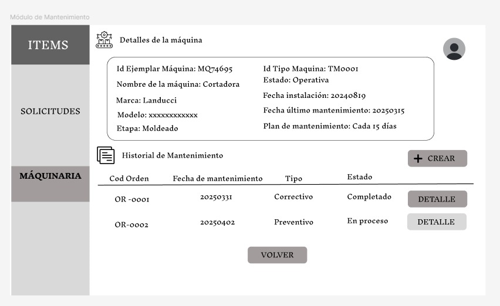
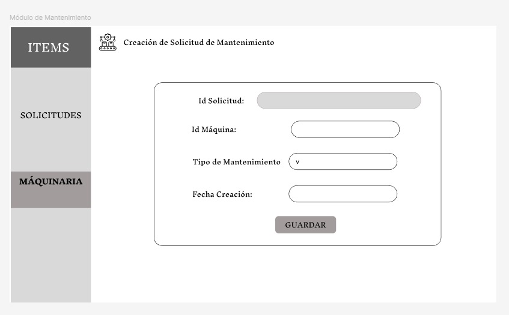
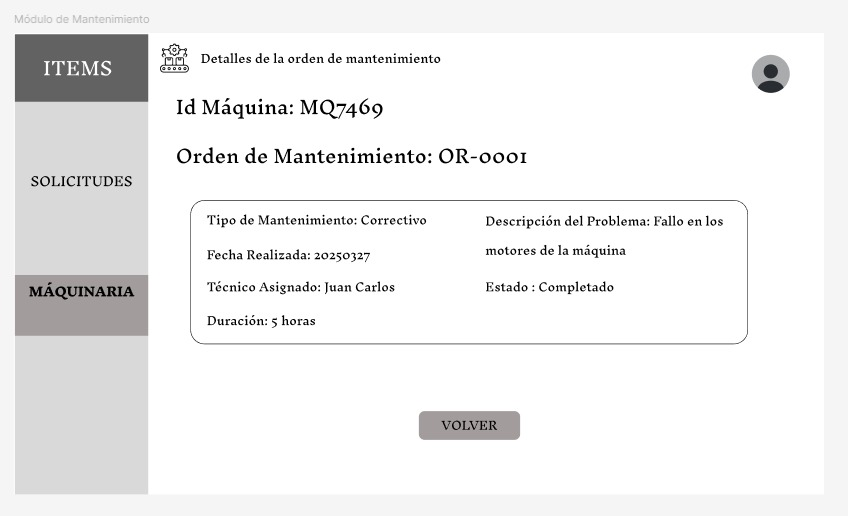

# 3.5.2 Módulo de Mantenimiento

## **Caso de uso #1:  Visualizar solicitudes de mantenimiento **

| **ID**               | CU-01                                                                   |
|----------------------|-------------------------------------------------------------------------|
| **Actor(es)**        | Responsable de mantenimiento                                            |
| **Descripción**      | Permite consultar el listado de solicitudes de mantenimiento registradas (correctivas y preventivas), filtrarlas por estado, tipo, máquina, técnico asignado o fecha.        |
| **Precondiciones**   | El usuario debe estar logueado y deben existir solicitudes registradas en el sistema.         |
| **Flujo Principal**  | 1. El usuario accede al módulo de mantenimiento.    2. Selecciona la opción "Solicitudes".   3.  Utiliza filtros de búsqueda si lo desea.   4.  El sistema muestra el listado de solicitudes según los criterios aplicados. |
| **Requerimientos Especiales** | La vista debe incluir información como: tipo de mantenimiento, estado, máquina, fecha programada y técnico asignado.    |
| **Frecuencia de Uso**| Frecuente, especialmente para supervisar y hacer seguimiento de las órdenes en curso o pendientes.   |  

## *Prototipo:*

## **Caso de uso #2:  Asignación de mantenimiento **

| **ID**               | CU-02                                                                   |
|----------------------|-------------------------------------------------------------------------|
| **Actor(es)**        | Responsable de mantenimiento                                            |
| **Descripción**      | Permite generar y asignar una orden de mantenimiento (correctivo o preventivo) a una máquina, seleccionando técnicos y una fecha específica.        |
| **Precondiciones**   | El usuario debe estar logueado y debe existir al menos una máquina en estado "requiere mantenimiento".          |
| **Flujo Principal**  | 1. El usuario accede al módulo de mantenimiento.    2. Selecciona la opción "Crear".   3.  Completa los campos requeridos.   4.  El sistema registra y notifica la orden creada. |
| **Requerimientos Especiales** | 	El sistema debe estar integrado con el plan de mantenimiento y evitar superposición de asignaciones. Debe actualizar el estado de la actividad a "Asignado".    |
| **Frecuencia de Uso**| Frecuente, según el plan de mantenimiento y ocurrencias de fallos.   |  

## *Prototipo:*

## **Caso de uso #3: Visualizar lista de máquinas**

| **ID**               | CU-03                                                                   |
|----------------------|-------------------------------------------------------------------------|
| **Actor(es)**        | Responsable de mantenimiento                                            |
| **Descripción**      | Permite al responsable de mantenimiento consultar la lista de máquinas registradas en planta, mostrando su id, nombre, etapa, último mantenimiento y estado.        |
| **Precondiciones**   | El usuario debe estar logueado en el sistema.           |
| **Flujo Principal**  | 1. El usuario accede al módulo de mantenimiento.    2. Selecciona la opción "Maquinaria".    3. El sistema muestra la lista de máquinas registradas.  |
| **Requerimientos Especiales** | Existencia previa de máquinas registradas en el sistema.    |
| **Frecuencia de Uso**| Frecuente, especialmente en tareas de monitoreo o mantenimiento.   |

## *Prototipo:*

## **Caso de uso #4: Visualizar detalles de la máquina**

| **ID**               | CU-04                                                                  |
|----------------------|-------------------------------------------------------------------------|
| **Actor(es)**        | Responsable de mantenimiento                                            |
| **Descripción**      | Permite consultar información detallada de una máquina específica, incluyendo sus características técnicas, plan e historial de mantenimiento.        |
| **Precondiciones**   | El usuario debe estar logueado en el sistema y debe existir al menos una máquina registrada.          |
| **Flujo Principal**  | 1. El usuario accede al módulo de mantenimiento.    2. Selecciona la opción "Detalles" de una máquina de la lista.   3. El sistema muestra los detalles completos de la máquina.  |
| **Requerimientos Especiales** | Visualización de datos técnicos y vínculo con historial de mantenimiento.   |
| **Frecuencia de Uso**| Moderada, dependiendo del seguimiento técnico de cada máquina.  |   

## *Prototipo:*

## **Caso de uso #5:  Crear solicitud de mantenimiento**

| **ID**               | CU-05                                                                 |
|----------------------|-------------------------------------------------------------------------|
| **Actor(es)**        | Responsable de mantenimiento / Técnico                                           |
| **Descripción**      | Permite registrar una solicitud de mantenimiento preventivo basada en el plan de mantenimiento, indicando la máquina, y fecha de solicitud.    |
| **Precondiciones**   | El usuario debe estar logueado y debe existir un plan de mantenimiento |
| **Flujo Principal**  | 1. El usuario accede al módulo de mantenimiento.    2. Selecciona la opción "Crear".   3. Ingresa los datos requeridos.   4. El sistema registra la solicitud como pendiente de asignación.   |
| **Requerimientos Especiales** | Dagnóstico previo    |
| **Frecuencia de Uso**| 	Regular, de acuerdo con la frecuencia definida en el plan de mantenimiento (semanal, mensual, trimestral, etc.).  |

## *Prototipo:*

## **Caso de uso #6:  Visualizar detalles de la orden de mantenimiento**

| **ID**               | CU-06                                                                 |
|----------------------|-------------------------------------------------------------------------|
| **Actor(es)**        | Responsable de mantenimiento / Técnico                                           |
| **Descripción**      | Permite acceder al detalle de una orden de mantenimiento realizada o pendiente, incluyendo descripción del problema, técnicos asignados, fecha y duración.    |
| **Precondiciones**   | La orden de producción debe existir en el sistema. |
| **Flujo Principal**  | 1. El usuario accede al módulo de mantenimiento.    2. Selecciona la opción "Detalles" de una orden de mantenimiento.   3. El sistema muestra los detalles completos de dicha orden.   |
| **Requerimientos Especiales** | Dagnóstico previo    |
| **Frecuencia de Uso**| Frecuente, especialmente para revisión de trabajos realizados o auditoría técnica.   |

## *Prototipo:*

