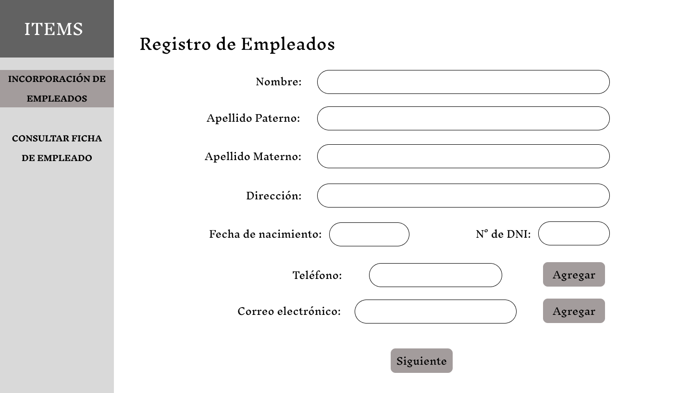
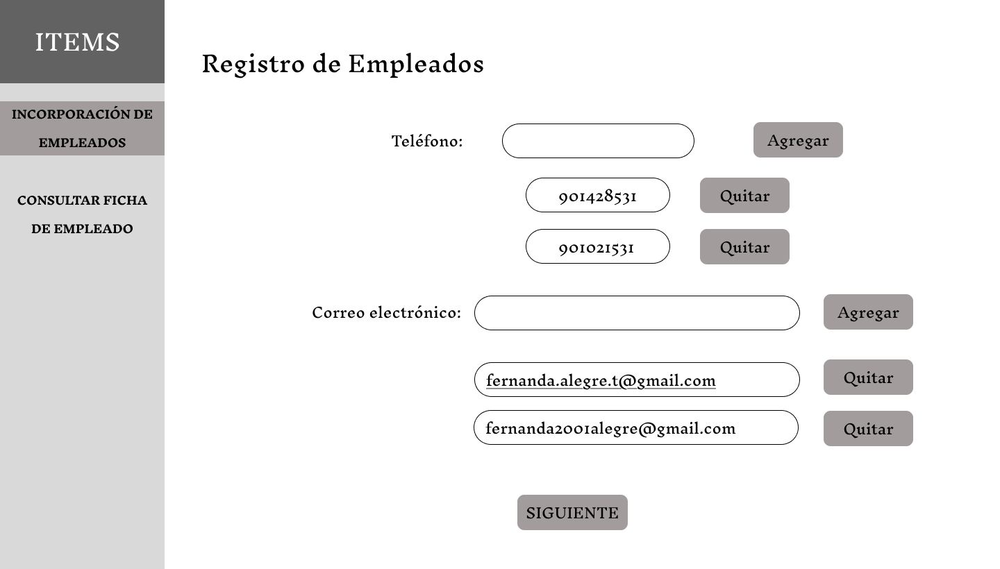
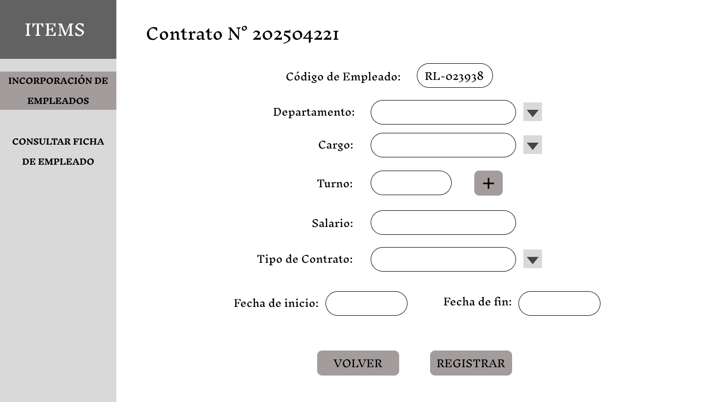
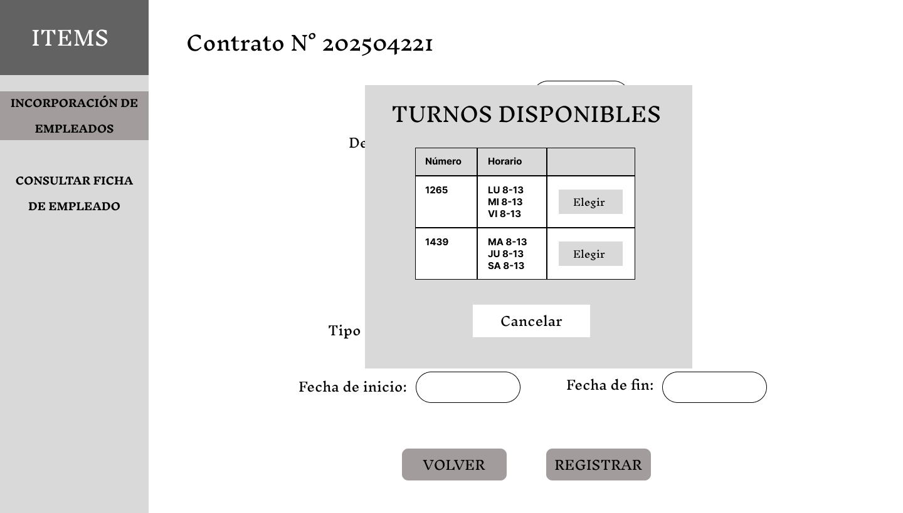
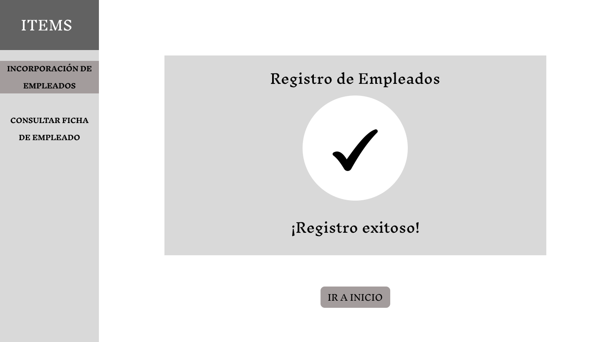
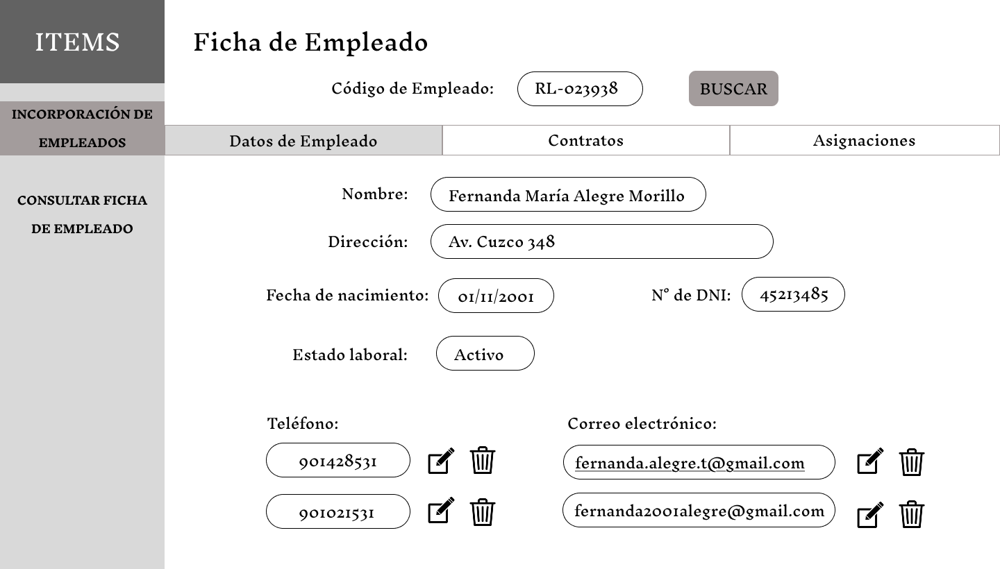
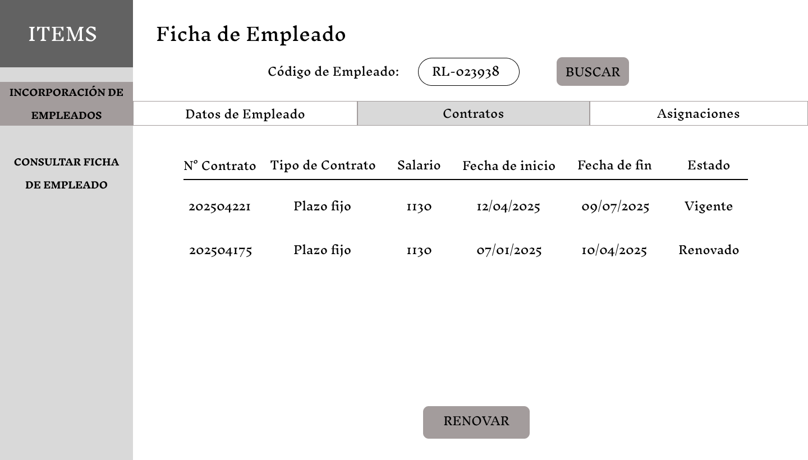
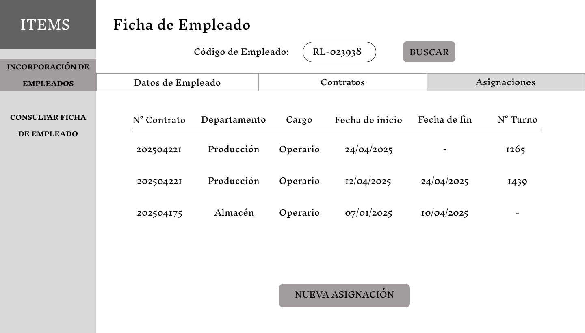
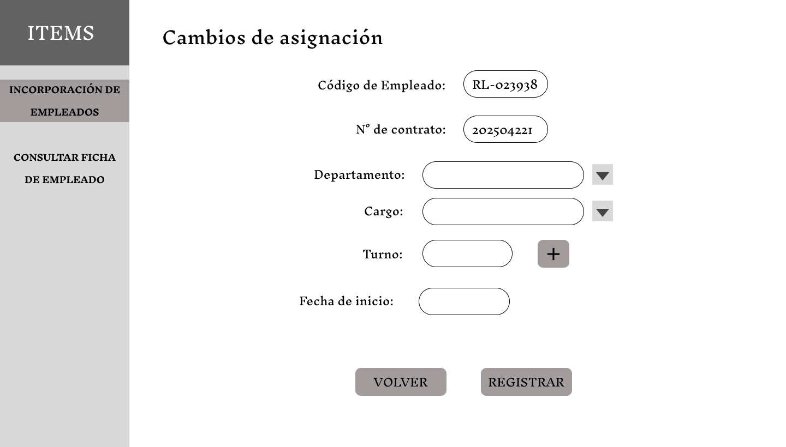

# **3.6. Módulo de Recursos Humanos**

## **Caso de uso #1: Gestionar incorporación de empleados**

| **ID**               | CU-01                                                                   |
|----------------------|-------------------------------------------------------------------------|
| **Actor(es)**        | Encargado de Recursos Humanos                                            |
| **Descripción**      | El encargado de RRHH registra a un nuevo empleado desde sus datos personales hasta su asignación laboral para que figure formalmente en la empresa |
| **Precondiciones**   | No debe existir previamente algún empleado registrado con ese DNI |
| **Flujo Principal**  | 1. El encargado registra los datos personales y de contacto del empleado   2. El encargado especifica el departamento al que pertencerá el empleado, el cargo que ocupará y el turno (dependiendo del departamento y cargo). También registrará los datos del salario y el tipo de contrato. Por último, se detalla la fecha de inicio y el fin del periodo de contrato   3. Si el empleado pertenecerá a los departamentos de Almacén o Producción, entonces el encargado de RRHH debe especificar el turno al que está asignado |
| **Requerimientos Especiales** | Validación de unicidad por número de documento (DNI). Además de contar con los catálogos predefinidos de cargos, turnos y departamentos |
| **Frecuencia de Uso**| Ocasional, según nuevas contrataciones aprobadas |

### **Flujo Principal:**
1. El encargado registra los datos personales y de contacto del empleado.

2. El encargado especifica el departamento al que pertencerá el empleado, el cargo que ocupará y el turno (dependiendo del departamento y cargo). También registrará los datos del salario y el tipo de contrato. Por último, se detalla la fecha de inicio y el fin del periodo de contrato. El código de empleado y el número de contrato se generan automáticamente.

3. Si el empleado pertenecerá a los departamentos de Almacén o Producción, entonces el encargado de RRHH debe especificar el turno al que está asignado.

## **Caso de uso #2: Consultar ficha del empleado**

| **ID**               | CU-02                                                                   |
|----------------------|-------------------------------------------------------------------------|
| **Actor(es)**        | Encargado de Recursos Humanos                                            |
| **Descripción**      | El encargado de RRHH puede consultar la información consolidada del trabajador: datos personales, laborales, historial de contratos y asignaciones |
| **Precondiciones**   | El trabajador debe existir en el sistema y el encargado debe tener permisos |
| **Flujo Principal**  | 1. El encargado ingresa a la sección de "Consulta Ficha de Empleado" e ingresa el código del empleado   2. El encargado visualizará tres pestañas: Datos personales, Contratos y Asignaciones. Puede consultar información del historial del empleado dentro de la empresa
| **Requerimientos Especiales** | El empleado debe existir en el sistema y estar asociado a un historial de asignaciones como de contratos |
| **Frecuencia de Uso**| Frecuente. Consultado regularmente por RRHH |

### **Flujo Principal:**
1. El encargado ingresa a la sección de "Consulta Ficha de Empleado" e ingresa el código del empleado.
2. El encargado visualizará tres pestañas: Datos personales, Contratos y Asignaciones. Puede consultar información del historial del empleado dentro de la empresa

## **Caso de uso #3: Gestionar renovación de contratos**

| **ID**               | CU-03                                                                   |
|----------------------|-------------------------------------------------------------------------|
| **Actor(es)**        | Encargado de Recursos Humanos                                            |
| **Descripción**      | Permite renovar un contrato laboral que está por vencer, manteniendo la trazabilidad del historial contractual. Puede generar un nuevo contrato o finalizar la relación si no se renueva |
| **Precondiciones**   | El contrato actual debe estar próximo a vencer o haber vencido, además de contar con el empleado con estado activo |
| **Flujo Principal**  | 1. El encargado consulta el historial de contratos del empleado   2. El encargado decide si renovar el contrato o no   3. Si el encargado procede con la renovación, entonces registrará otro contrato nuevamente |
| **Requerimientos Especiales** | Registro de la fecha de fin del periodo contractual |
| **Frecuencia de Uso**| Periódica, cada vez que vencen contratos |

### **Flujo Principal:**
1. El encargado consulta el historial de contratos del empleado.

2. El encargado decide si renovar el contrato o no
3. Si el encargado procede con la renovación, entonces registrará otro contrato nuevamente

## **Caso de uso #4: Gestionar cambios de asignación laboral**

| **ID**               | CU-04                                                                   |
|----------------------|-------------------------------------------------------------------------|
| **Actor(es)**        | Encargado de Recursos Humanos                                            |
| **Descripción**      | Permite registrar cambios en el área, cargo o turno del trabajador. Cada nuevo cambio genera una entrada en el historial de asignaciones. |
| **Precondiciones**   | El trabajador debe estar activo |
| **Flujo Principal**  | 1. El encargado consulta el historial de asignaciones del empleado   2. El encargado registra la nueva asignación ingresando los datos correspondientes |
| **Requerimientos Especiales** | Validación de la disponibilidad de los turnos y/o cargos |
| **Frecuencia de Uso**| Ocasional, cada vez que hay reestructuración interna. |

### **Flujo Principal:**
1. El encargado consulta el historial de asignaciones del empleado.

2. El encargado registra la nueva asignación ingresando los datos correspondientes.
