# **3.6. Módulo de Distribución**

## **Caso de uso #1: Registrar Orden de Carga**

| **ID**               | CU-01                                                                   |
|----------------------|-------------------------------------------------------------------------|
| **Actor(es)**        | Encargado de Distribución                                            |
| **Descripción**      | Iniciar una Orden de carga a partir de productos ya asignados desde el almacén, especificando destino y condiciones de despacho. Previamente se coordina la programación de la distribución con el área de Ventas.           |
| **Precondiciones**   | El usuario debe estar registrado y deben haber solicitudes pendientes de distribución desde el área de Ventas.           |
| **Flujo Principal**  | 1. El usuario ingresa fecha y hora programada para la salida    2. El usuario especifica el tipo de transporte (propio o tercerizado)    3. El usuario registra los datos del transportista y vehículo   4. El usuario registra los productos y las cantidades entregadas para despachar   5. Generar la guía de remisión   6. Notificar al transportista con los datos de la ruta (origen, destino, fecha y hora de salida, etc) |
| **Requerimientos Especiales** | Solicitudes de Distribución Pendientes para atender.    |
| **Frecuencia de Uso**| Ocasional, depende de la frecuencia de pedidos recibidos en Ventas.                     |

### **Flujo Principal:**
1. El encargado de Distribución debe atender las solicitudes pendientes de distribución.
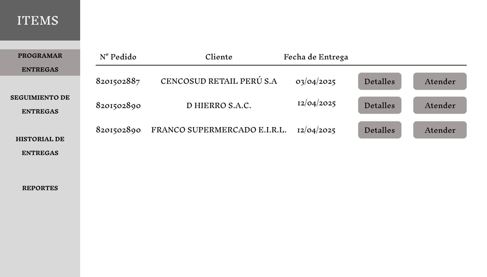
2. Puede acceder a los detalles de cada pedido para consultar la fecha de entrega programada, el destino, el cliente o incluso la cantidad de empaques de cada producto.
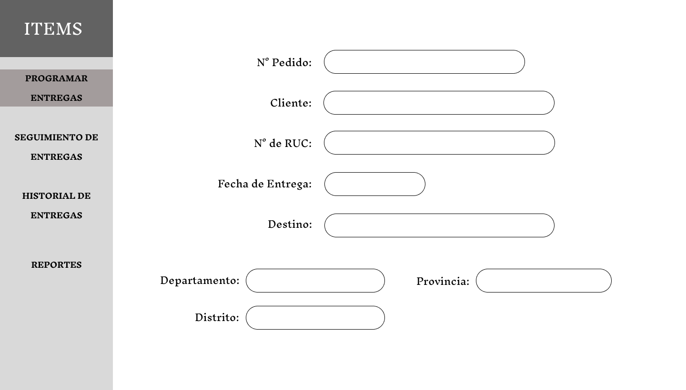
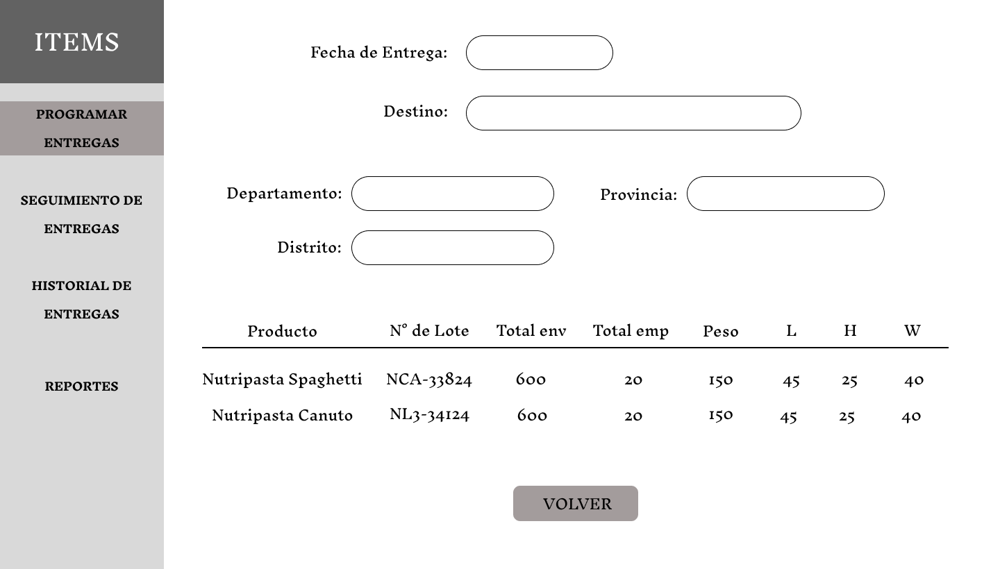
3. Si el encargado escoge la opción "Atender" de la pantalla inicial, entonces se mostrarán una serie de órdenes de carga ya programadas. Dependiendo de los detalles de cada orden de carga, el encargado puede asignar el pedido a una orden existente o puede crear una nueva.
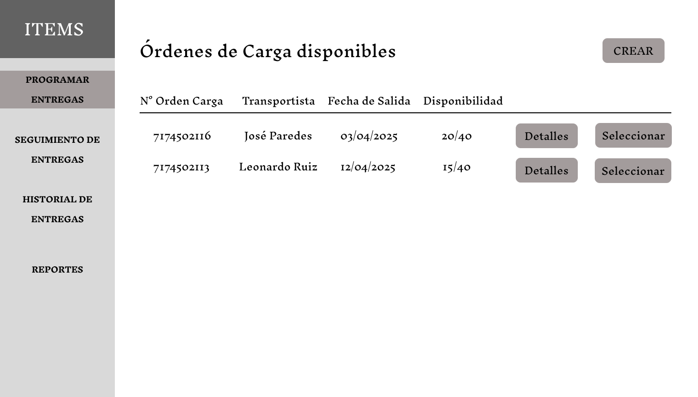
Detalles de una orden de carga:
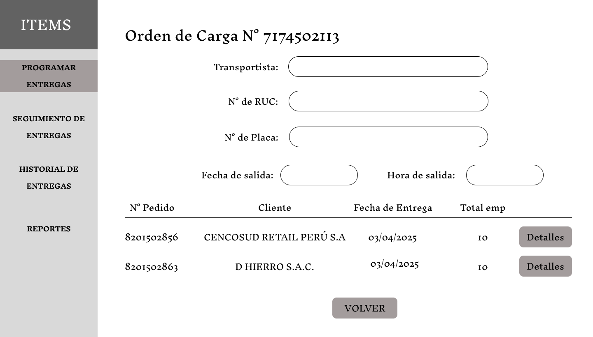
Programar una orden de carga:
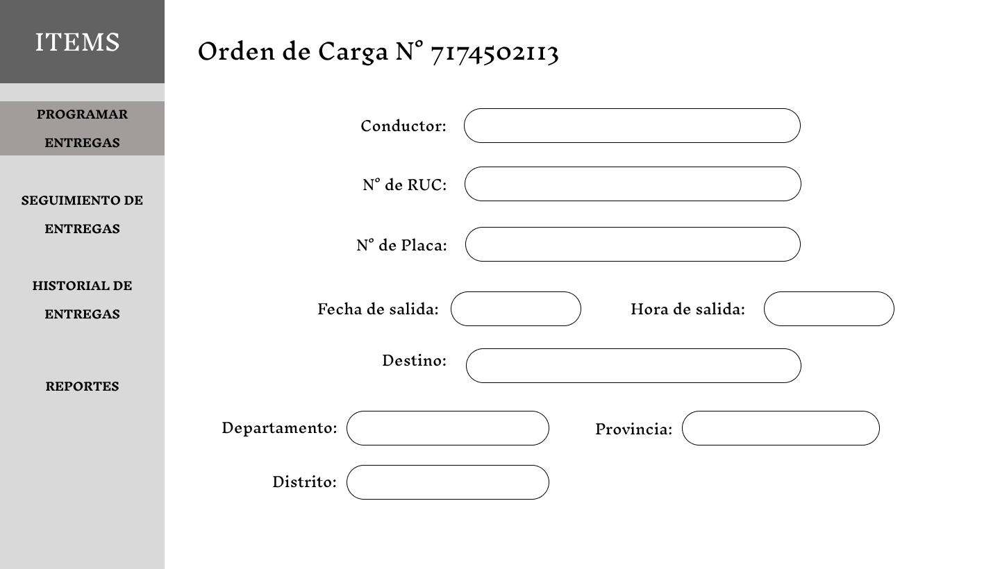
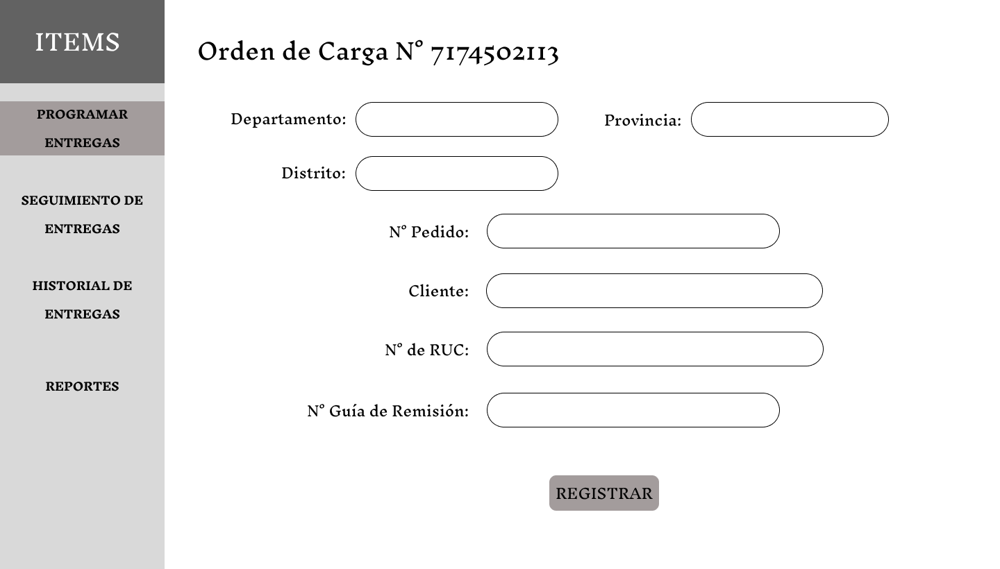

## **Caso de uso #2: Registrar ejecución del Despacho**

| **ID**               | CU-02                                                                   |
|----------------------|-------------------------------------------------------------------------|
| **Actor(es)**        | Transportista                                        |
| **Descripción**      | Confirmar que los productos han salido de planta y están en tránsito hacia su destino.           |
| **Precondiciones**   | Orden de carga debe estar registrada.   |
| **Flujo Principal**  | 1. Seleccionar Orden de Carga    2. Confirmar fecha y hora de salida real    3. Cambiar estado a “En tránsito”  |
| **Requerimientos Especiales** | Órdenes de Carga previamente programadas. |
| **Frecuencia de Uso**| Ocasional, depende de la frecuencia de pedidos recibidos en Ventas.                     |

### **Flujo Principal:**
1. El transportista verá una pantalla inicial con todas las órdenes de carga programadas que se le asignaron.
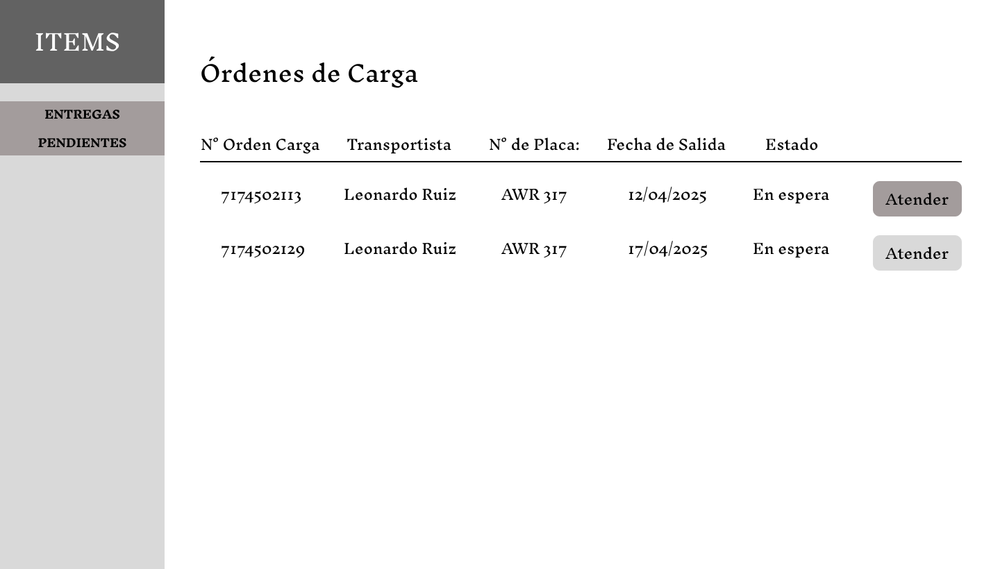
2. El transportista registra la fecha y hora de salida real de la orden de carga.
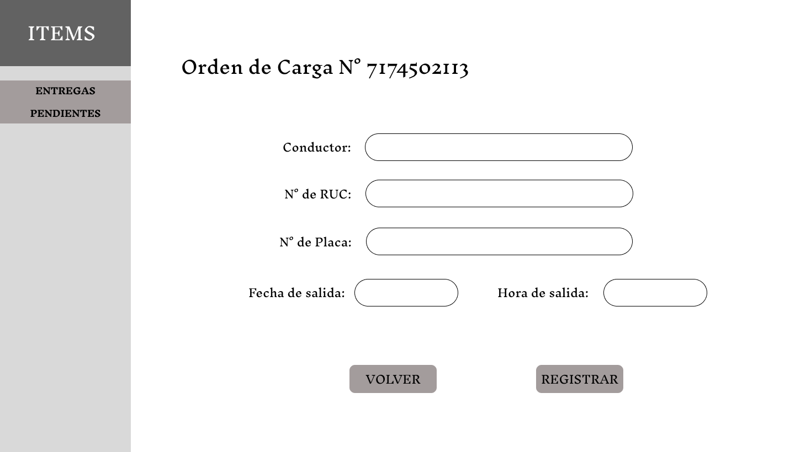

## **Caso de uso #3: Registrar confirmación de la Entrega**

| **ID**               | CU-03                                                                   |
|----------------------|-------------------------------------------------------------------------|
| **Actor(es)**        | Transportista                                        |
| **Descripción**      | Registrar que el destino recibió la mercancía correctamente.           |
| **Precondiciones**   | Orden debe estar en estado “En tránsito”.   |
| **Flujo Principal**  | 1. Seleccionar Orden de Carga    2. Registrar fecha y hora de entrega real    3. Registrar datos del receptor (nombre, ruc, etc)   4. Registrar cambios en la Guia de Remisión  |
| **Requerimientos Especiales** | Guía de remisión previamente creada. |
| **Frecuencia de Uso**| Ocasional, depende de la frecuencia de pedidos recibidos en Ventas.                     |

### **Flujo Principal:**
1. Durante el despacho, el transportista puede registrar la confirmación de entrega primero seleccionando la orden de carga y pedido correspondientes.
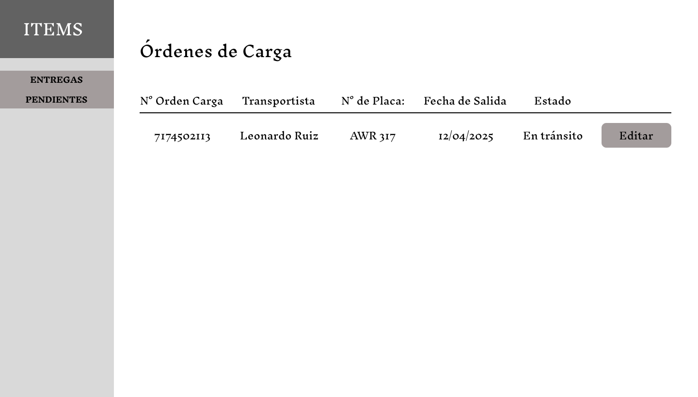
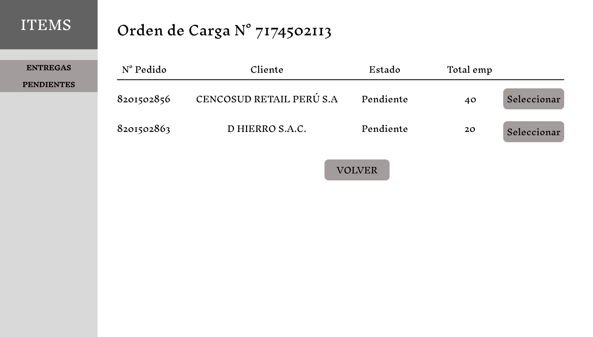
2. El transportista registra la fecha y hora de entrega, es decir, cuando se recepcionaron los productos.
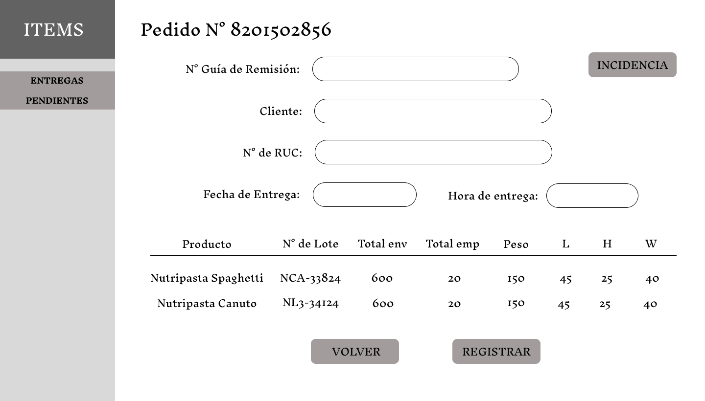
3. Cuando el transportista termina de despachar debe indicar la finalización de la orden de carga.
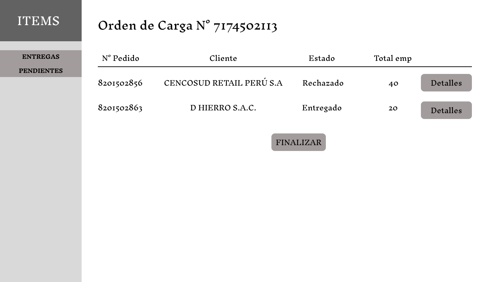

## **Caso de uso #4: Registrar Incidencia de Entrega**

| **ID**               | CU-04                                                                   |
|----------------------|-------------------------------------------------------------------------|
| **Actor(es)**        | Transportista                                        |
| **Descripción**      | Registrar problemas durante el despacho, el cliente rechaza el producto entregado y solicita un cambio con otros productos.           |
| **Precondiciones**   | Guia de Remision cuenta con datos de la entrega   |
| **Flujo Principal**  | 1. Seleccionar Orden de Carga y Guía de Remisión    2. Ingresar tipo de incidencia    3. Registrar cambios en el estado de la Entrega   |
| **Requerimientos Especiales** | Registrar el Acta de Incidencia |
| **Frecuencia de Uso**| Eventual, solo cuando hay incidencias.            |

### **Flujo Principal:**
1. Cuando el receptor no se encuentra conforme con la entrega se debe registrar la incidencia indicando el tipo (Faltan productos, Empaque defectuoso, etc).

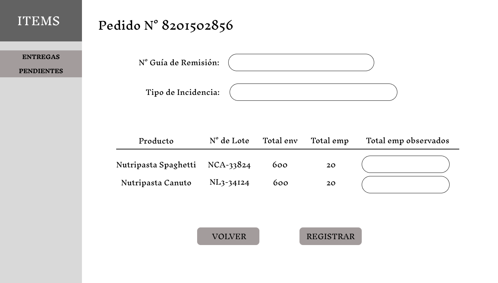

## **Caso de uso #5: Consultar Historial de Despachos**

| **ID**               | CU-05                                                                   |
|----------------------|-------------------------------------------------------------------------|
| **Actor(es)**        | Encargado de Distribución                                        |
| **Descripción**      | Visualizar entregas anteriores filtrando de acuerdo a ciertos parámetros como fecha, cliente, entre otros.           |
| **Precondiciones**   | Registro de Cada Orden de Carga para asegurar la trazabilidad   |
| **Flujo Principal**  | 1. Filtrar historial por fecha, transportista, estado o cliente    2. Visualizar el estado actual de cada Orden de Carga    3. Consultar detalles de cada Orden de Carga y Guía de Remisión   |
| **Requerimientos Especiales** | Generación de reportes de Despacho |
| **Frecuencia de Uso**| Semanal o mensual, según necesidad de control.            |

### **Flujo Principal:**
1. Como parte del seguimiento y control de los despachos, se muestran todas las órdenes de carga que están pendientes o ya están en proceso.

2. El encargado de Distribución puede realizar consultas del historial de despachos de acuerdo a ciertos filtros.
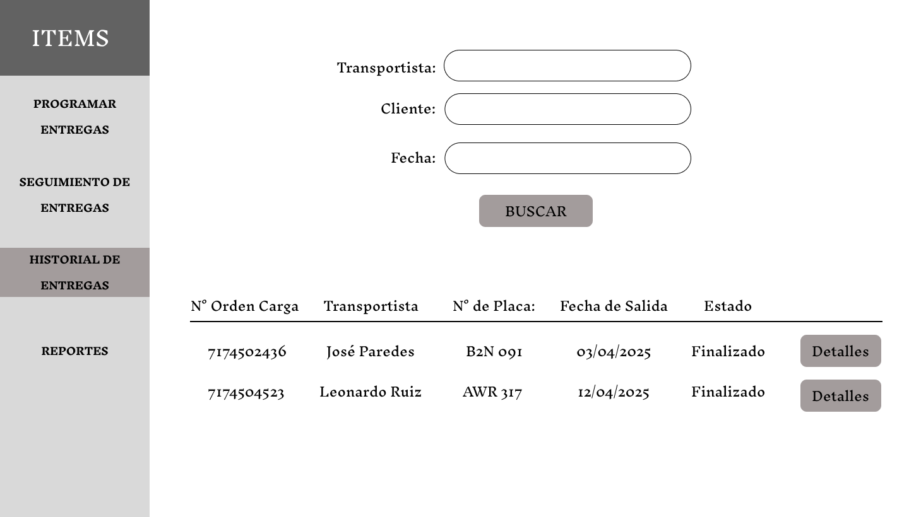