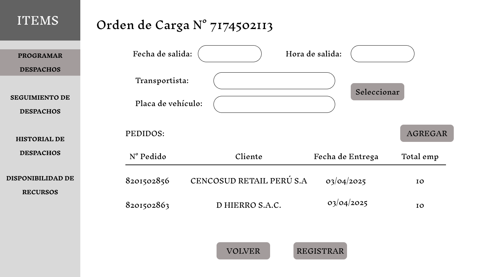
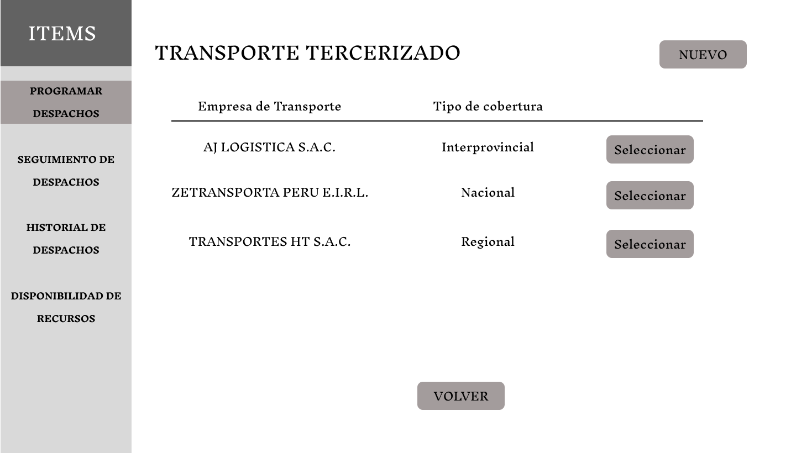
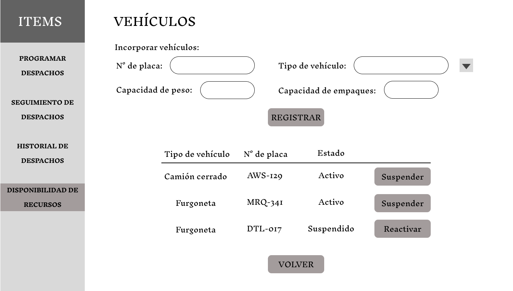
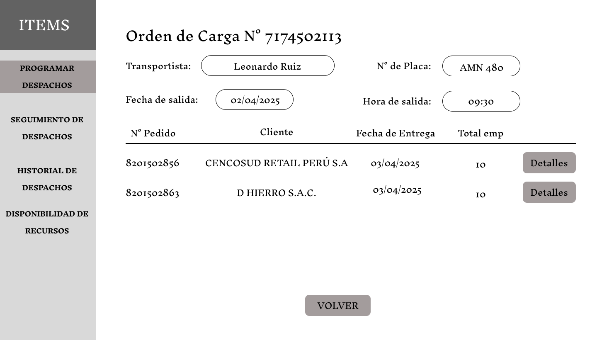
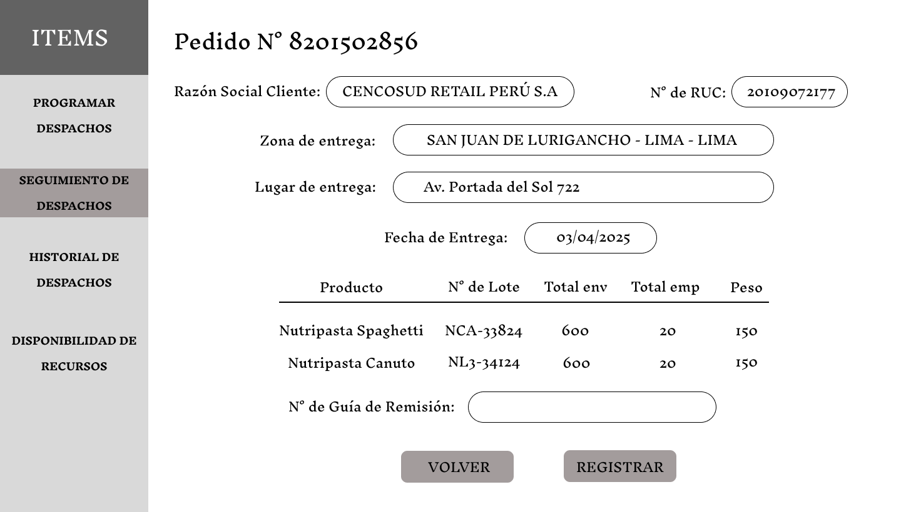
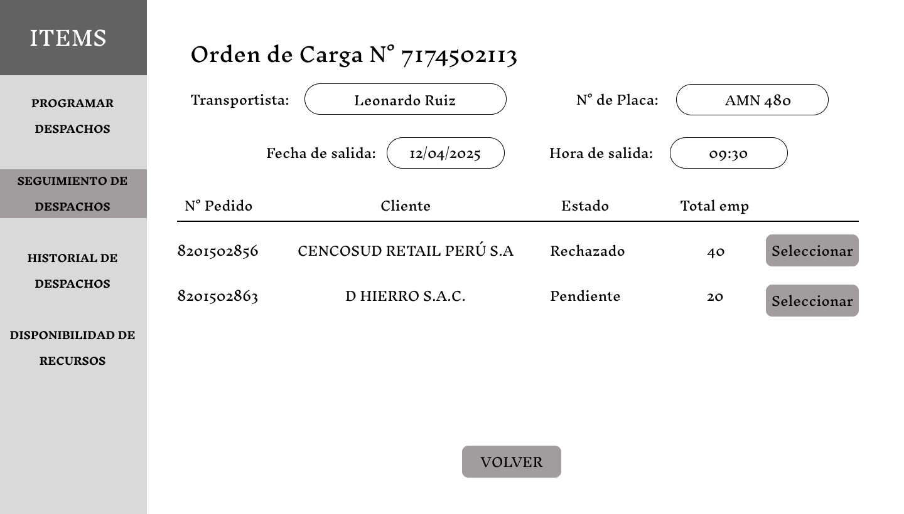

# 3.6. Módulo de Distribución

## **Caso de uso #1: Programar el Despacho**

| **ID**               | CU-01                                                                   |
|----------------------|-------------------------------------------------------------------------|
| **Actor(es)**        | Encargado de Distribución                                            |
| **Descripción**      | El encargado programa despachos de acuerdo a los pedidos del cliente debido a que cuenta con la fecha programada de entrega y la cantidad de productos que contiene dicho pedido. Debe comprometer recursos para generar la Orden de Carga |
| **Precondiciones**   | Debe estar registrado el pedido del cliente con detalles como la fecha de entrega, lugar de entrega y productos que se solicitan |
| **Flujo Principal**  | 1. El encargado recibe datos de los pedidos de los clientes pendientes de programación de despacho   2. Si el encargado escoge programar una nueva Orden de Carga registrará datos de la fecha, el compromiso de recursos y la selección de pedidos   3. Si el encargado decide asignar el pedido del cliente a una Orden de Carga existente deberá seleccionarlo. Previamente puede consultar detalles del contenido de la Orden de Carga y su capacidad   4. Se notifica al transportista los datos de la ruta (origen, destino, fecha y hora de salida) y los pedidos que debe despachar |
| **Requerimientos Especiales** | Registro previo de los pedidos del cliente y verificación de la disponibilidad de los recursos (Transportista/Vehiculo) |
| **Frecuencia de Uso**| Ocasional, depende de la frecuencia de pedidos recibidos en Ventas.                     |

### **Flujo Principal:**
1. El encargado de Distribución tiene una serie de pedidos pendientes de programación del despacho correspondiente. Puede ver sus detalles, asignarlo a una Orden de Carga ya creada o programar una nueva Orden de Carga.

2. Si escoge programar una nueva Orden de Carga, el encargado debe especificar los datos de la salida, comprometer al transportista y vehículo, además de agregar pedidos a la Orden de Carga de acuerdo a la capacidad del vehículo (si es propio)

Al momento de dar click al botón "Seleccionar", el encargado de Distribución puede especificar el tipo de transporte (propio o tercerizado) y de acuerdo a ello registrar la información correspondiente.

2.1. Si escoge un tipo de transporte tercerizado, el encargado debe seleccionar una empresa de transporte previamente registrada, o incluso puede registrar una nueva.

Cuando escoge registrar una nueva empresa de transporte, el encargado debe ingresar información de la empresa, del conductor y del vehículo.

Si decide escoger una empresa de transporte previamente registrada:

Cuando quiera agregar más conductores y vehículo de dicha empresa:

2.2. Por otro lado, si el encargado escoge un tipo de transporte propio de la empresa, entonces debe comprometer al transportista y vehículo perteneciente a la empresa.

La acción de agregar más registros se encuentra en la sección "Disponibilidad de recursos". El encargado puede cambiar el estado de los recursos (transportista y vehículo), ya sea suspendiéndolos o habilitándolos, o incluso puede registrar nuevos recursos.

En el caso de los transportistas propios de la empresa, los demás datos personales y de contacto provienen de otras entidades porque los Empleados actúan como Transportistas. Ambos provienen de la entidad supertipo Persona que tiene especialización traslapada.

Finalmente se procede con la asignación de pedidos a la Orden de Carga. El encargado puede revisar los detalles de cada pedido así como seleccionarlos para asignarlos a la Orden.

El detalle no especifica los lotes porque todavía no procede el picking respectivo.

3. Por otra parte, si el encargado decide asignar los pedidos a una Orden de Carga puede profundizar en sus detalles y seleccionarlo.

Detalle de la Orden de Carga. Se observa que los recursos ya están asignados así como los pedidos seleccionados para la orden.

El detalle del Pedido incluye lotes porque se realizó el picking correspondiente.

## **Caso de uso #2: Generar Guías de Remisión**

| **ID**               | CU-02                                                                   |
|----------------------|-------------------------------------------------------------------------|
| **Actor(es)**        | Encargado de Distribución                                            |
| **Descripción**      | El encargado crea y emite las Guías de Remisión para que el transportista pueda realizar el transporte cumpliendo las regulaciones legales |
| **Precondiciones**   | Debe realizarse el picking previamente para especificar qué lotes están asignados a un pedido de cliente |
| **Flujo Principal**  | 1. El encargado de Distribución realiza el seguimiento de las órdenes de carga, cuando estas requieran las guías de remisión el encargado deberá emitirlas   2. Si ya se realizó el picking de los pedidos que contiene una Orden de Carga, entonces el encargado debe registrar y emitir las Guías de Remisión del tipo "Venta"   3. Si se registran incidencias en las entregas de los pedidos, el encargado debe crear Guías de Remisión del tipo "Devolución" para dejar una constancia de que los productos observados están volviendo al almacén   4. Ambos casos se notifican al transportista para que continúe con su movimiento regular |
| **Requerimientos Especiales** | Registro previo del cliente, la dirección de origen y destino. Se requiere la Orden de Picking, en ella se encuentra la información de los lotes específicos y las cantidades que se despacharán |
| **Frecuencia de Uso**| Regular, las guías son necesarias para cuando se realice la fiscalización del transporte  |

### **Flujo Principal:**
1. El encargado de Distribución realiza el seguimiento por medio de una pantalla inicial que muestra el estado de cada orden de carga.

2. Si el estado de una Orden de Carga indica "Picking listo", entonces el usuario puede acceder a cada pedido e ingresar el número de guía de remisión correspondiente.

Se muestran los detalles que requiere la Guía de Remisión, estos datos se obtuvieron de registros previos, el encargado debe registrar el número de guía. 

3. Por otro lado, si el estado de la Orden de Carga indica "Incidencia", entonces el usuario debe emitir una guía de remisión del tipo "Devolución" para que se mantenga un registro de la cantidad que está volviendo al almacén, el nuevo origen y nuevo el destino del transportista.
En el detalle de la Orden se observa un pedido con estado "Rechazado", de este proviene la incidencia de entrega.

Para asegurar la trazabilidad se muestra el detalle del pedido que fue rechazado parcial o totalmente. En estos detalles se indica el motivo del rechazo y las cantidades que se devolverán al almacén.

En la siguiente pantalla se muestran los datos correspondientes a la guía de remisión del tipo "Devolución". Es necesario para permitir la continuidad del transporte.

## **Caso de uso #3: Seguimiento de los Despachos**

| **ID**               | CU-03                                                                   |
|----------------------|-------------------------------------------------------------------------|
| **Actor(es)**        | Encargado de Distribución                                            |
| **Descripción**      | El encargado puede consultar el estado actual de los despachos programados |
| **Precondiciones**   | Deben registrarse las especificaciones y detalles de cada Órden de Carga. Para los transportes tecerizados, se registra el resultado final (el seguimiento está planteado para el transporte propio de la empresa) |
| **Flujo Principal**  | 1. El encargado de Distribución realiza el seguimiento de las órdenes de carga, puede consultar los detalles de entrega identificando al transportista, los productos y la fecha   2. El encargado puede recuperar los datos de un despacho finalizado por medio del historial en el que también se pueden consultar por los detalles específicos |
| **Requerimientos Especiales** | Registro de eventos anteriores como la programación de la Orden de Carga, la Orden de Picking y el Registro de Entrega |
| **Frecuencia de Uso**| Regular, las guías son necesarias para cuando se realice la fiscalización del transporte  |

### **Flujo Principal:**
1. El encargado de Distribución realiza el seguimiento por medio de una pantalla inicial que muestra el estado de cada orden de carga.

Un ejemplo de como se detalle la Orden de Carga

2. El encargado también puede consultar los datos de órdenes de carga finalizadas recientemente.

## **Caso de uso #4: Registro de Entrega**

| **ID**               | CU-04                                                                   |
|----------------------|-------------------------------------------------------------------------|
| **Actor(es)**        | Transportista                                        |
| **Descripción**      | Registrar que el cliente recibió conforme los productos o si los rechazó |
| **Precondiciones**   | Orden debe estar en estado “En tránsito”   |
| **Flujo Principal**  | 1. Registrar fecha y hora de salida real   2. Seleccionar Orden de Carga y Pedido   3. Registrar fecha y hora de entrega real    4. Registrar datos del receptor   5. En caso se rechace el producto debe registrarse la cantidad de empaques observados y el tipo de incidencia   6. Si se rechaza el producto se notifica al encargado de Distribución para que emita la Guía de Remisión del tipo de "Devolución" |
| **Requerimientos Especiales** | Guías de remisión previamente emitidas por el encargado de Producción para el traslado y entrega |
| **Frecuencia de Uso**| Regular, el transportista siempre debe dar finalización a las Órdenes de Carga |

### **Flujo Principal:**
1. El transportista debe registrar la fecha y hora de salida efectiva correspondiente a la Orden de Carga

2. Durante el despacho, el transportista puede registrar la confirmación de entrega primero seleccionando la orden de carga y el pedido correspondiente.

3. El transportista debe registrar la información correspondiente a cada lote del producto de acuerdo a las observaciones y conformidad del cliente, en caso de rechazo se notifica automáticamente al encargado de Distribución. Además de también registrar al receptor de la entrega.

4. Luego del registro de entregas o incidencias se procede con la finalización y cierre de la Orden de Carga.

## **Caso de uso #5: Consultar Guías de Remisión**

| **ID**               | CU-05                                                                   |
|----------------------|-------------------------------------------------------------------------|
| **Actor(es)**        | Transportista                                        |
| **Descripción**      | Consultar los detalles de las guías de remisión de cada entrega o devolución |
| **Precondiciones**   | Registro de las Guías de Remisión por el encargado de Distribución |
| **Flujo Principal**  | 1. Consultar la lista de Guías de Remisión correspondientes a cada pedido   2. Consultar los detalles de la Guía de Remisión |
| **Requerimientos Especiales** | Guías de remisión previamente emitidas por el encargado de Producción para el traslado y entrega |
| **Frecuencia de Uso**| Regular, el transportista siempre debe dar finalización a las Órdenes de Carga |

### **Flujo Principal:**
1. El transportista puede consultar las Guías de Remisión. Por defecto, estas suelen ser del tipo "Venta" que significa un despacho común.

2. El transportista también puede recibir Guías de Remisión del tipo "Devolución" para proceder con el traslado de retorno de los productos al almacén.

